# tGD

<p align="center">
  
  
  
  
  
</p>

<p align="center">
  <a href="README.md">English</a> | <a href="README.zh-TW.md">繁體中文</a> | <a href="README.ja.md">日本語</a> | <a href="README.de.md">Deutsch</a>
</p>
<p align="center">
  <a href="https://openclawyhwang-hub.github.io/tGD/">🌐 GitHub Pages</a> &nbsp;|&nbsp; <a href="https://openclawyhwang-hub.github.io/tGD/tGD-intro.html">🎬 Intro</a>
</p>

**Ihr PDLC wurde für Menschen entwickelt. Jetzt erledigen Agenten die Arbeit.**

tGD verwandelt Ihren bestehenden Workflow in eine **agentic PDLC Pipeline** — gleiche Gates, gleiche Verantwortung, 10× Geschwindigkeit.

Map → Define → Plan → Develop → Verify → Review → Release

Funktioniert mit Claude Code, Codex CLI, Gemini CLI, OpenCode, Pi Coding Agent und Hermes Agent.

---

## 🤔 Warum tGD?

**Das Problem ist nicht, dass Agenten nicht programmieren können. Es ist, dass niemand sie zur Verantwortung zieht.**

**❌ Ohne Harness:**
- Agent sagt "sollte funktionieren" — Tests liefen nie
- Schreibt 500 Zeilen, bevor er Ihre Codebasis liest
- Überspringt die Spezifikation, liefert einen kaputten PR und verschwindet

**✅ Mit tGD:**
- Agent sagt "34/34 bestanden" — und zeigt die Ausgabe
- Liest zuerst die Codebasis, schreibt 50 Zeilen, die bestehen
- Spec → Plan → Code → Verify — keine Stufe wird übersprungen

---

## 🎯 Für wen?

| Ihre Rolle | Wie tGD hilft |
|------------|---------------|
| **Solo-Entwickler** | Schneller liefern mit diszipliniertem KI-Workflow. Der Agent übernimmt Specs, Tests, Reviews |
| **Team-Lead** | Standards für KI-generierten Code durchsetzen. Jeder PR folgt derselben 7-Stufen-Pipeline |
| **Startup** | Schnell bewegen, ohne etwas zu zerstören. Der Harness fängt Agent-Fehler vor der Produktion ab |
| **Enterprise** | Qualitätsgates für KI-Entwicklung. Security, Performance und Compliance werden durchgesetzt |

---

## 🚀 Schnellstart

### 1. Clone & Setup
```bash
git clone https://github.com/openclawyhwang-hub/tGD.git && cd tGD
bash setup.sh
```
> Erkennt installierte CLIs automatisch. tgd-agent-browser-Abhängigkeiten werden automatisch installiert.
>
> Dies installiert auch die `tgd` CLI in Ihren PATH für zukünftige Verwendung.

### Installationsoptionen

| Befehl | Beschreibung |
|--------|-------------|
| `bash setup.sh` | Erstinstallation (aus dem geklonten Repository ausführen) |
| `tgd` | tGD installieren oder aktualisieren (nach der Erstinstallation) |
| `tgd --version` (`-v`) | Aktuelle Version anzeigen (CalVer: YYYY.M.D) |
| `tgd --upgrade` (`-u`) | Erneuern: ungültige Symlinks bereinigen und alle Links/Hooks neu erstellen |
| `tgd --uninstall` | Alle tGD-Installation entfernen, ohne andere Dateien zu beeinträchtigen |

### Auf neueste Version aktualisieren

```bash
cd ~/tGD && git pull && tgd --upgrade
```

Lädt den neuesten Source von GitHub und erneuert alle symlinks/hooks. Deine bestehenden Features in `$TGD_DIR/<feature>/` bleiben erhalten.

### 2. Agent starten
```bash
claude   # Claude Code
codex    # Codex CLI
opencode # OpenCode
gemini   # Gemini CLI
pi       # Pi Coding Agent
hermes   # Hermes Agent
```

### 3. Projekt initialisieren
```
/tgd-map
```
> Agent scannt die Codebasis und erstellt `CONTEXT.md`.

### 4. Erstes Feature bauen
```
/tgd-define Ich möchte Benutzer-Authentifizierung hinzufügen
```
> Agent interviewt Sie, erstellt PRD + SPEC.

### Claude Desktop (ohne Terminal)

Nutzen Sie Claude Desktop statt eines Coding-Agent? tGD funktioniert im **halbautomatischen Modus** — Claude erstellt die Artefakte, Sie führen die Terminal-Befehle aus.

→ [Claude Desktop Einrichtungsanleitung](docs/claude-desktop-setup.md)

---

## 💡 Praxisbeispiele

### Beispiel 1: Projekt mappen
```
Benutzer: /tgd-map

Agent: Neben dem aktuellen Repo, gibt es weitere Repositories zum Referenzieren? (local path oder git URL)
Benutzer: github.com/CopilotKit/CopilotKit

Agent: CopilotKit wird geklont...
→ `understand` skill wird auf Hauptrepo ausgeführt...
→ `understand` skill wird auf CopilotKit ausgeführt...
→ $TGD_DIR/CONTEXT.md erstellt
→ Dashboard: http://localhost:3838
→ Bereit für /tgd-define
```

### Beispiel 2: Feature definieren
```
Benutzer: /tgd-define Ich möchte JWT-Authentifizierung

Agent: Feature-Name — wählen Sie einen:
  1. jwt-auth
  2. token-authentication
  3. auth-jwt-middleware
Benutzer: 1

Agent: Welche Endpunkte brauchen Auth?
  1. Spezifische Routen (/api/profile, /api/settings)
  2. Alle Routen außer /api/login, /api/register
  3. Rollenbasiert (admin vs user)
Benutzer: 1

Agent: Erstelle PRD + SPEC...
→ $TGD_DIR/jwt-auth/PRD.md
→ $TGD_DIR/jwt-auth/SPEC.md

Agent: Hat dieses Feature eine UI-Komponente?
  1. Ja (Design generieren)
  2. Nein (nur Backend)
Benutzer: 1

Agent: Generiere 3 HTML-Prototypen...
→ $TGD_DIR/jwt-auth/prototype/variant-a.html
→ $TGD_DIR/jwt-auth/prototype/variant-b.html
→ $TGD_DIR/jwt-auth/prototype/variant-c.html

Agent: Wählen Sie eine Designrichtung:
  A. Minimal kartengestützt (sauber, fokussiert)
  B. Dichtes Dashboard (Power-User-orientiert)
  C. Geteilte Ansicht (kontextreich)
Benutzer: A

Agent: Schreibe DESIGN.md...
→ $TGD_DIR/jwt-auth/DESIGN.md
→ Bereit für /tgd-plan
```

### Beispiel 3: Verifizieren (strenger Ton)
```
Benutzer: /tgd-verify

Agent: Test-Suite wird ausgeführt...
→ 47 bestanden, 1 fehlgeschlagen
→ FEHLER: test_login_empty_password — ValidationError erwartet, aber 200 OK erhalten

Agent: Wird an /tgd-develop zur Behebung übergeben.

[... /tgd-develop behebt auth.py ...]

Benutzer: /tgd-verify

Agent: Test-Suite wird ausgeführt...
→ 48 bestanden, 0 fehlgeschlagen
→ Exit code 0
→ Bereit für /tgd-review
```

---

## ⚙️ Pipeline

```mermaid
flowchart LR
    A["🔍 MAP\n/tgd-map"] --> B["📋 DEFINIEREN\n/tgd-define"]
    B --> C["📐 PLANEN\n/tgd-plan"]
    C --> D["⚡ ENTWICKELN\n/tgd-develop"]
    D --> E["🧪 VERIFIZIEREN\n/tgd-verify"]
    E --> F["🔎 REVIEW\n/tgd-review"]
    F --> G["🚀 RELEASE\n/tgd-release"]

    classDef cyan fill:#0e7490,color:#ecfeff,stroke:#22d3ee
    classDef green fill:#059669,color:#ecfdf5,stroke:#34d399
    classDef blue fill:#2563eb,color:#eff6ff,stroke:#60a5fa
    classDef purple fill:#7c3aed,color:#f5f3ff,stroke:#a78bfa
    classDef amber fill:#d97706,color:#fffbeb,stroke:#fbbf24
    classDef rose fill:#e11d48,color:#fff1f2,stroke:#fb7185
    classDef teal fill:#0d9488,color:#f0fdfa,stroke:#5eead4
    classDef indigo fill:#4f46e5,color:#eef2ff,stroke:#818cf8

    class A cyan
    class B green
    class C blue
    class D purple
    class E amber
    class F rose
    class G indigo
```



## 🔑 Hauptfunktionen

### 📖 Projektdokumentation im DeepWiki-Stil
`/tgd-map` kompiliert die CodeGraph- + Understand-Anything-Analyse in eine **einzige, in sich geschlossene `wiki.html`** unter `$TGD_DIR/wiki/` — per Doppelklick öffnen, kein Server, kein Build-Schritt, kein node/npm. Sie erhalten:
- **Einheitliche Struktur über alle Projekte** — dasselbe Seitengerüst (Home, Übersicht, Architektur, Onboarding, Module, Flows, Quellcode, Suche); nur die Daten variieren
- **Multi-Repo-Unterstützung** — Repo-Auswahl auf der Startseite und Sidebar-Umschalter bei mehreren gescannten Repos
- **Offline-Suche** — Repos, Module, Symbole, Flows und Quelldateien, alles clientseitig
- **Symbol → Quellcode-Sprünge** — Funktionen/Klassen in Modultabellen verlinken in den eingebauten Quellcode-Browser mit Zeilenhervorhebung
- **Mermaid-Diagramme** — Architektur, Abhängigkeiten und Graphen pro Modul; der Renderer ist eingebettet, Diagramme funktionieren offline
- **Markdown-Zwilling für Agenten & GitHub** — `wiki/docs/` spiegelt dieselbe Struktur als reines `.md` (GitHub rendert es, inkl. Mermaid) mit `manifest.json` als maschinenlesbarem Index
- **Teilbar** — schicken Sie eine Datei an einen Kollegen; sie öffnet sich einfach

Alles liegt in `$TGD_DIR/wiki/`, das Wiki verschmutzt also nie Ihr Code-Repo.
Das Layout ist über alle Projekte einheitlich, weil das HTML-Template im `tgd-wiki-generation`-Skill mitgeliefert wird — es gibt keinen artefaktseitigen Schalter, der die Struktur ändern könnte.

### 🏖️ Pflicht-Worktree-Isolierung
Beim Ausführen von `/tgd-develop` erstellt tGD **automatisch eine Git-Worktree-Sandbox** (`../project-<feature>/`), bevor Code geschrieben wird. Das stellt sicher:
- Ihre `$TGD_DIR/`-Planungsdateien (PRD, SPEC, TASKS) bleiben sauber und unberührt.
- Scheitert ein Experiment, wird die Worktree einfach entfernt — Ihre Pläne sind sicher.
- Die Sandbox wird nach bestandener Verifikation automatisch gemerged und aufgeräumt.

### 🚦 Intelligentes Ausführungs-Routing
Während `/tgd-develop` routet tGD die Arbeit intelligent nach Task-Anzahl:
| Task-Anzahl | Modus | Verhalten |
|---|---|---|
| **< 3 Tasks** | ⚡ Schnellmodus | Haupt-Agent implementiert direkt in der Worktree. Schnell und token-effizient. |
| **≥ 3 Tasks** | 🔀 Qualitätsmodus | Delegiert an Subagenten mit Zwei-Stufen-Review (Spec-Konformität → Code-Qualität). Höchste Qualität. |

### 🧠 Drei-Quellen-Planung
Während `/tgd-plan` liest der Agent **drei Dokumente**, bevor Tasks erstellt werden:
1. **`CONTEXT.md`** — Bestehende Projektstruktur, Konventionen und Tech-Stack
2. **`PRD.md`** — Geschäftsziele, User-Pain-Points und Scope-Grenzen
3. **`SPEC.md`** — Technische Anforderungen, API-Contracts und Datenbankschemata

So spiegelt `TASKS.md` reale Randbedingungen wider, nicht nur theoretische Specs.

### 🎯 3-Option Feature-Naming
Bei `/tgd-define` schlägt der Agent **drei verschiedene kebab-case-Namen** für Ihr Feature vor und wartet, bis Sie einen wählen (oder einen eigenen vorschlagen). Kein Raten mehr — Sie kontrollieren die Benennung vom ersten Tag an.

### 🔄 Smarte Jira-Integration
Beim Sync zu Jira erstellt tGD nicht einfach blind Issues. Es:
- **Erkennt** die Pflichtfelder Ihres Projekts über die `createmeta`-API
- **Lässt Sie den Issue-Type wählen** (Story, Task, Bug, etc.)
- **Formatiert** jedes Issue mit strukturierter `As a... I want...`-Zusammenfassung und `Given/When/Then`-Akzeptanzkriterien
- **Umgeht Proxys** automatisch mit `curl -x ""`

---

## ⌨️ Commands

### CLI (`tgd`)

Die `tgd` CLI verwaltet Installation, Updates und Diagnose:

| Befehl | Beschreibung |
|--------|-------------|
| `bash setup.sh` | Erstinstallation (aus dem geklonten Repository ausführen) |
| `tgd` | tGD installieren oder aktualisieren (nach der Erstinstallation) |
| `tgd --version` (`-v`) | Version anzeigen (CalVer) |
| `tgd --upgrade` (`-u`) | Links und Hooks erneuern |
| `tgd --release` | GitHub-Release erstellt (liest VERSION) |
| `tgd --uninstall` | Alle tGD-Installationen entfernen |

**Auf neueste Version aktualisieren:** `cd ~/tGD && git pull && tgd --upgrade` — einzeiler.

### Slash Commands

7 Stufen von der Idee bis zur Produktion. Jede Stufe gatekept die nächste.

| 🎯 Was | ⌨️ Command | 💡 Prinzip | 🔧 Skills |
|---|---|---|---|
| Projekt verstehen | `/tgd-map` | Kontext vor Änderungen + durchsuchbares Wiki | `tgd-context-engineering` + `codegraph init` + `understand-dashboard` + `tgd-wiki-generation` |
| Definition | `/tgd-define` | 3-Option-Naming + Produkt + Spezifikation | `tgd-interview-me` → `tgd-idea-refine` → `tgd-spec-driven-development` |
| Planung | `/tgd-plan` | CONTEXT + PRD + SPEC → Atomare Tasks | `tgd-planning-and-task-breakdown` → `tgd-jira-auto-sync` |
| Sandbox-Bau | `/tgd-develop` | **Pflicht-Worktree** + Intelligentes Routing | `tgd-source-driven-development` → (`subagent` OR `incremental`) → `tgd-test-driven-development` |
| Beweis erbringen | `/tgd-verify` | Tests sind der Beweis | `tgd-debugging-and-error-recovery` → `tgd-test-driven-development` → **Cross-Feature Regression Gate** |
| Review vor Merge | `/tgd-review` | Code-Qualität verbessern | `tgd-code-review-and-quality` → `tgd-code-simplification` |
| Produktion | `/tgd-release` | Schneller ist sicherer | `tgd-git-workflow-and-versioning` → `tgd-shipping-and-launch` → **Regression Catalog Update + Audit** |

---

## 🧪 Test-Strategie

Testen ist in tGD kein einzelner Schritt — es ist eine fortschreitende Disziplin über fünf Stufen, die aufeinander aufbauen:

```
Plan            Develop           Verify            Review            Release
─────           ────────          ──────            ──────            ────
BDD             TDD               Run ALL tests     Code review       Regression
(Given-When-    (Red-Green-       Generate          Audit test        Catalog
 Then)           Refactor)         TEST-REPORT       quality           Update + Audit
  │                │                  │                 │                │
  ▼                ▼                  ▼                 ▼                ▼
TASKS.md         code + tests     TEST-REPORT.md    REVIEW.md         CHANGELOG
DEV signs        DEV signs        QA signs          QA+DEV signs      PM signs
                                                                  + CATALOG
```

### 📋 Plan: BDD definiert, was getestet wird

Der Agent liest PRD.md + SPEC.md und schreibt jede Aufgabe als **BDD-Akzeptanzkriterien**:

```markdown
## Task 1: Login-API implementieren
- **Acceptance Criteria**:
  - Given registered user + correct password, When POST /login, Then 200 + JWT token
  - Given wrong password, When POST /login, Then 401 Unauthorized
  - Given missing fields, When POST /login, Then 400 + error message
```

Die Qualität der BDD-Kriterien bestimmt die Testqualität. Vage Kriterien ("User kann sich einloggen") → Agent muss Grenzfälle raten. Präzise Kriterien ("Falsches Passwort → 401") → Agent schreibt präzise Tests.

BDD erzeugt **keinen** Testcode — es liefert Akzeptanzkriterien, die im Develop-Schritt zu Testcode werden.

### 🔧 Develop: TDD baut die Tests

Der Agent folgt **Red-Green-Refactor**:

1. **Red** — Alle Tests zuerst schreiben (sie schlagen fehl — noch kein Produktionscode)
2. **Green** — Produktionscode schreiben, damit die Tests bestehen
3. **Refactor** — Code aufräumen, Tests bestehen weiterhin

Testquellen:
- TASKS.md BDD → Happy-Path-Tests
- SPEC.md API-Contracts → Grenzfälle (falsche Typen, fehlende Felder, nicht autorisiert)
- PRD.md Akzeptanzkriterien → **Regressionstests** (markiert mit stack-spezifischem Marker)

Der Agent erkennt den Test-Runner automatisch aus dem SPEC.md Tech-Stack:

| Stack | Test Runner | Regression Marker |
|-------|------------|-------------------|
| Python | pytest | `@pytest.mark.regression` |
| TypeScript/JS | vitest / jest | `*.regression.test.ts` naming or tag |
| Go | `go test` | `//go:build regression` or `TestXxxRegression` naming |
| Rust | `cargo test` | Naming convention |
| Java | junit / mvn test | `@Tag("regression")` |
| E2E (any) | tgd-agent-browser | Separate regression suite |

### 🧪 Verify: Tests ausführen + Report generieren

Agent führt **alle** Tests aus und generiert automatisch `TEST-REPORT.md`. Das Format ist sprachunabhängig:

```markdown
# TEST REPORT: jwt-auth
Generated: 2026-06-12T10:30:00+08:00
Stack: Python + pytest
Command: pytest -v --tb=short

## Summary
| Metric     | Value |
|------------|-------|
| Total      | 24    |
| Passed     | 23    |
| Failed     | 1     |
| Skipped    | 0     |
| Coverage   | 87%   | ← optional, omit if not configured
| Regression | 8/8 ✅ |

## All Test Cases (auto-generated from test runner output)
| Test                      | Module              | Result | Regression |
|---------------------------|---------------------|--------|------------|
| test_login_valid_creds    | tests/test_login.py | ✅     | ✅         |
| test_login_wrong_password | tests/test_login.py | ✅     | ✅         |
| test_login_missing_field  | tests/test_login.py | ❌     | —          |

## Failures
| Test                     | Error                    | Location              |
|--------------------------|--------------------------|-----------------------|
| test_login_missing_field | assert 500 == 400        | tests/test_login.py:42|

## Sign-off
- [ ] **QA**: (pending)
```

TEST-REPORT.md wird **automatisch** aus der Test-Runner-Ausgabe generiert, nicht manuell gepflegt.

**Frontend-Pflicht:** Wenn SPEC.md UI enthält, MUSS Verify `tgd-agent-browser` für E2E-Browser-Tests ausführen.

### 🏷️ Regression: Das Sicherheitsnetz

Regressionstests sind akzeptanznahe Tests, die **vor jedem Release bestehen müssen**. Sie wachsen mit jedem Feature — jedes neue Feature fügt seine Akzeptanztests zu `REGRESSION-CATALOG.md` hinzu.

**Was ist Regression?**
- Tests, die aus den Akzeptanzkriterien der PRD abgeleitet werden (in TASKS.md mit `[R]` markiert)
- Sie prüfen, dass bestehende Features nach neuem Code noch funktionieren
- Ohne Regression können neue Features alte stillschweigend kaputtmachen

**So wächst der Catalog:**

```
Feature 1 (auth):     8 regression tests   ← Release schreibt in REGRESSION-CATALOG.md
Feature 2 (dashboard): +5 regression tests  ← Catalog hat jetzt 13 Einträge
Feature 3 (payments):  +6 regression tests  ← Catalog hat jetzt 19 Einträge
```

Das Release jedes Features erfordert 100% Regression — nicht nur die neuen Tests, **alle** akkumulierten Einträge aus dem Catalog.

**Der REGRESSION-CATALOG Lifecycle:**

1. **Plan** — Akzeptanzkriterien in TASKS.md mit `[R]` markieren
2. **Develop** — TDD erstellt die tatsächlichen Testdateien für jedes `[R]`-Kriterium
3. **Release** — Scannt TASKS.md nach `[R]`-Einträgen, hängt an `REGRESSION-CATALOG.md` an (kumulativ)
4. **Release (Catalog Audit)** — Jeder Eintrag geprüft: Testdatei existiert? Bestanden? Feature deprecated? Veraltete Einträge entfernen
5. **Verify** — Liest `REGRESSION-CATALOG.md`, führt alle Einträge neu aus. Ein Fehlschlag = Hard Stop

**So werden Tests markiert:** Der Agent markiert akzeptanznahe Tests mit dem passenden Stack-Marker (siehe Tabelle oben). Nicht alle Tests sind Regression — nur Tests, die PRD-Akzeptanzkriterien oder kritische User-Pfade prüfen.

**Wann ausführen:**
- `/tgd-verify` → führt alle Tests aus + liest `REGRESSION-CATALOG.md`, führt jeden Catalog-Eintrag neu aus
- `/tgd-release` → schreibt neue `[R]`-Einträge in Catalog + auditiert bestehende Einträge auf Aktualität
- Jederzeit → direkt (z.B. `pytest -m regression`), ohne tGD-Wrapper

### 🔍 Review: Testqualität prüfen

Agent erstellt REVIEW.md mit:
- Codequalitäts-Analyse
- Testqualitäts-Bewertung (fehlende Grenzfälle?)
- Security- / Performance-Scan (falls relevant)
- Test-Pyramide prüfen: 80% Unit, 15% Integration, 5% E2E

Sign-off: **QA + DEV** unterschreiben beide.

### 🚀 Release: Die Regression-Schranke

Release ist die einzige harte Schranke in tGD. Vor der Ausführung prüft der Agent:

```
PRD.md        → PM signed?      ✅
TASKS.md      → DEV signed?     ✅
TEST-REPORT   → QA signed?      ✅
              → Regression 100%? ✅
              → Failed = 0?      ✅
REVIEW.md     → QA + DEV signed? ✅

All ✅ → proceed to Release
Any ❌ → STOP: "X has not approved Y yet"
```

---

## 👥 Menschliche Rollen & Sign-off

tGD hat drei menschliche Rollen. Jedes Artifact hat einen `## Sign-off`-Bereich am Ende:

| Rolle | Fokus | Prüft | Sign-off für |
|-------|-------|-------|-------------|
| **PM** | Produktrichtung | PRD (Was & Warum) | PRD.md, Release |
| **DEV** | Implementierungsqualität | TASKS, Code | TASKS.md, Code, REVIEW.md |
| **QA** | Testqualität & Coverage | TEST-REPORT, Testqualität | TEST-REPORT.md, REVIEW.md |

**So funktioniert es:**
- Agent produziert Artifact → Mensch prüft auf eigenem Rechner → bearbeitet `## Sign-off` im Artifact → commit & push
- Agent prüft Sign-off-Checkboxen vor dem nächsten Schritt (Gate 3)
- Release ist das harte Gate: alle erforderlichen Sign-offs müssen `[x]` sein
- Format: `- [x] **PM**: Approved — Datum — Kommentar` oder `- [x] **QA**: Rejected — Datum — Grund`
- Eine Person kann mehrere Rollen haben (bei kleinen Teams üblich)
- Kein zusätzliches Werkzeug nötig — git ist der Koordinationsmechanismus

---

## 🔗 Integrationen

### Jira Data Center
Wenn `/tgd-plan` eine `TASKS.md` generiert, kann der **`tgd-jira-auto-sync`** Skill automatisch Jira-Issues erstellen:
```
/tgd-plan → generiert TASKS.md → Benutzer bestätigt → erstellt Jira-Issues
```

---

## 🤖 Agent Personas

| Agent | Rolle | Perspektive |
|-------|-------|-------------|
| [code-reviewer](agents/code-reviewer.md) | Senior Staff Engineer | "Würde ein Staff Engineer das genehmigen?" |
| [test-engineer](agents/test-engineer.md) | QA-Spezialist | Test-Strategie & Prove-It-Muster |
| [security-auditor](agents/security-auditor.md) | Security Engineer | Schwachstellenerkennung |

Personas rufen keine anderen Personas auf — der User (oder ein Slash Command) ist der Orchestrator.

---

## 🧩 So funktionieren Skills

Jeder Skill folgt einer konsistenten Anatomie:
1. **Frontmatter**: Name, Beschreibung, Trigger
2. **Workflow**: Schritt-für-Schritt-Anweisungen
3. **Verifikation**: Gates die bestanden werden müssen
4. **Anti-Rationalisierung**: Gegen "faule Agent"-Ausreden

**Progressive Disclosure** – Agent lädt Details nur bei Bedarf.

---

## 📊 Leistung

| Metrik | Wert |
|--------|------|
| **Geladene Skills** | 29 (On-Demand, nicht alle gleichzeitig) |
| **Kontextnutzung** | ~5% pro Skill (Progressive Disclosure) |
| **Setup-Zeit** | < 30 Sekunden |
| **Erstes Feature** | ~15 Minuten (von `/tgd-define` bis `/tgd-release`) |

---

## ❓ FAQ

**Q: Muss ich etwas außer dem Agent installieren?**
A: Repository klonen und `bash setup.sh` ausführen. Erkennt Ihren CLI automatisch und installiert die `tgd` CLI mit.

**Q: Was wenn mein Agent keine Slash Commands unterstützt?**
A: Sagen Sie "Plane dieses Feature" – tGD mappt Intent automatisch.

**Q: Kann ich Stufen überspringen?**
A: Jede Stufe hat Pre-flight-Checks. Überspringen blockiert die nächste Stufe.

**Q: Funktioniert es mit bestehenden Projekten?**
A: Ja! `/tgd-map` scannt zuerst die bestehende Codebasis.

**Q: Kann ich die Pipeline anpassen?**
A: Ja! Bearbeiten Sie die Skill-Dateien in `skills/`, um sie an den Workflow Ihres Teams anzupassen.

---

## 📁 Projektstruktur

### Laufzeitausgabe (wird während der Entwicklung generiert)

Beispiel: SaaS-Anwendung mit Express-Backend + React-Frontend, zwei Features in unterschiedlichen Phasen:

```
workspace/
├── my-project-backend/                           # Backend repo (Express + Prisma)
│   ├── .codegraph → ../my-project-tGD/.scans/my-project-backend/.codegraph
│   ├── .understand-anything → ../my-project-tGD/.scans/my-project-backend/.understand-anything
│   ├── src/
│   │   ├── routes/
│   │   │   ├── auth.ts                 # ← user-auth feature
│   │   │   ├── payment.ts              # ← payment-flow feature
│   │   │   └── health.ts
│   │   ├── models/
│   │   │   ├── user.ts
│   │   │   └── payment.ts
│   │   └── middleware/
│   │       └── jwt.ts
│   └── tests/
│       ├── auth.test.ts
│       └── payment.test.ts
│
├── my-project-frontend/                           # Frontend repo (React + Vite)
│   ├── .codegraph → ../my-project-tGD/.scans/my-project-frontend/.codegraph
│   ├── .understand-anything → ../my-project-tGD/.scans/my-project-frontend/.understand-anything
│   ├── src/
│   │   ├── components/
│   │   │   ├── LoginForm.tsx           # ← user-auth feature
│   │   │   ├── PaymentForm.tsx         # ← payment-flow feature
│   │   │   └── Dashboard.tsx
│   │   └── pages/
│   │       ├── login.tsx
│   │       └── checkout.tsx
│   └── tests/
│       ├── LoginForm.test.tsx
│       └── PaymentForm.test.tsx
│
└── my-project-tGD/                           # ← $TGD_DIR (sibling, not inside)
    ├── CONTEXT.md                      # Repo inventory: my-project-backend, my-project-frontend
    ├── CHANGELOG.md
    │   # v1.0.0 - user-auth shipped
    │   # v1.1.0 - payment-flow shipped
    │
    ├── .scans/                         # Centralized scan data
    │   ├── my-project-backend/
    │   │   ├── .codegraph/
    │   │   └── .understand-anything/
    │   └── my-project-frontend/
    │       ├── .codegraph/
    │       └── .understand-anything/
    │
    ├── user-auth/                      # Feature 1: shipped ✅
    │   ├── PRD.md                      # "Users need to log in"
    │   ├── SPEC.md                     # Backend: JWT + bcrypt / Frontend: LoginForm
    │   ├── DESIGN.md                   # Login page mockup
    │   ├── prototype/
    │   │   ├── variant-a.html          # Minimal login form
    │   │   └── variant-b.html          # Login with social buttons
    │   ├── TASKS.md                    # 5 tasks, all done
    │   ├── REVIEW.md                   # Passed: 87% coverage
    │   └── decisions/
    │       └── ADR-001-use-jwt.md      # Why JWT over sessions
    │
    └── payment-flow/                   # Feature 2: in planning 🚧
        ├── PRD.md                      # "Users need to pay"
        ├── SPEC.md                     # Backend: Stripe API / Frontend: PaymentForm
        ├── DESIGN.md                   # Checkout page mockup
        ├── prototype/
        │   ├── variant-a.html          # Single-page checkout
        │   └── variant-b.html          # Multi-step checkout
        └── TASKS.md                    # 8 tasks, not started
```

**Wichtige Punkte:**
- **Geschwister**: `my-project-backend/`, `my-project-frontend/`, `my-project-tGD/` sind auf gleicher Ebene — tGD ist NICHT in den Code-Repos
- **Feature-first**: jedes Feature (`user-auth/`, `payment-flow/`) hat eigenen Ordner mit allen Artefakten
- **Multi-Repo**: SPEC.md und TASKS.md taggen Einträge nach Repo-Name (z.B. `[my-project-backend]`, `[my-project-frontend]`)
- **Saubere Code-Repos**: an der Wurzel nur `.codegraph` + `.understand-anything` Symlinks + `src/` + `tests/`
- **Einheitliches Changelog**: CHANGELOG.md im tGD-Root protokolliert alle Features über alle Repos

**Symlink-Kette** (wie Scan-Daten fließen):
```
my-project-backend/.codegraph → my-project-tGD/.scans/my-project-backend/.codegraph
```

**Phase → Artefakt-Zuordnung:**

| Phase | Befehl | Artefakte | Ort |
|-------|--------|-----------|-----|
| Map | `/tgd-map` | CONTEXT.md | `$TGD_DIR/CONTEXT.md` |
| Define | `/tgd-define` | PRD.md, SPEC.md, DESIGN.md, prototype/ | `$TGD_DIR/<feature>/` |
| Plan | `/tgd-plan` | TASKS.md (+ TRACKING-PLAN.md entries) | `$TGD_DIR/<feature>/TASKS.md` · `$TGD_DIR/TRACKING-PLAN.md` |
| Develop | `/tgd-develop` | src/ + tests/ | Code-Repository (worktree) |
| Verify | `/tgd-verify` | TEST-REPORT.md | `$TGD_DIR/<feature>/TEST-REPORT.md` |
| Review | `/tgd-review` | REVIEW.md | `$TGD_DIR/<feature>/REVIEW.md` |
| Release | `/tgd-release` | CHANGELOG.md, METRICS.md, REGRESSION-CATALOG.md, git tag | `$TGD_DIR/` + `$TGD_DIR/<feature>/METRICS.md` |

### Repository-Inhalt
```
tGD/
├── skills/                     # 29 Skills
├── agents/                     # 3 Spezialisten-Personas
├── references/                 # Checklisten (Sicherheit, Tests, etc.)
├── .claude/commands/           # Claude Code Slash Commands
├── .gemini/commands/           # Gemini CLI Commands
├── .opencode/commands/         # OpenCode Commands
├── .codex/prompts/             # Codex CLI Prompts
├── scripts/                    # Setup & Validierung
└── docs/                       # Plattformspezifische Guides
```

---

## 📦 Alle 29 Skills

Die obigen Commands sind Einstiegspunkte. Das Paket enthält insgesamt 29 Skills — 27 Lifecycle-Skills plus den `tgd-router`-Meta-Skill und die `tgd-rules`-Kernregeln.

<details>
<summary><b>🧭 Meta (2)</b></summary>

| Skill | Zweck |
|-------|-------|
| [tgd-router](skills/tgd-router/SKILL.md) | Arbeit dem richtigen Skill zuordnen |
| [tgd-rules](skills/tgd-rules/SKILL.md) | Kernregeln — Verifikations-Grundgesetz, Anti-Rationalisierung |
</details>

<details>
<summary><b>🗺️ Map (2)</b></summary>

| Skill | Zweck |
|-------|-------|
| [tgd-context-engineering](skills/tgd-context-engineering/SKILL.md) | Richtige Infos an Agent liefern |
| [tgd-wiki-generation](skills/tgd-wiki-generation/SKILL.md) | Doku-Site im DeepWiki-Stil für mehrere Repos |
</details>

<details>
<summary><b>📋 Define (4)</b></summary>

| Skill | Zweck |
|-------|-------|
| [tgd-interview-me](skills/tgd-interview-me/SKILL.md) | Benutzer-Intent durch Q&A extrahieren |
| [tgd-idea-refine](skills/tgd-idea-refine/SKILL.md) | Divergentes/konvergentes Denken |
| [tgd-spec-driven-development](skills/tgd-spec-driven-development/SKILL.md) | PRD + SPEC vor Code |
| [tgd-sketch](skills/tgd-sketch/SKILL.md) | Wegwerf-HTML-Mockups: 2-3 Design-Varianten |
</details>

<details>
<summary><b>📐 Plan (2)</b></summary>

| Skill | Zweck |
|-------|-------|
| [tgd-planning-and-task-breakdown](skills/tgd-planning-and-task-breakdown/SKILL.md) | In TASKS.md zerlegen |
| [tgd-jira-auto-sync](skills/tgd-jira-auto-sync/SKILL.md) | Jira-Issues automatisch erstellen |
</details>

<details>
<summary><b>⚡ Develop (8)</b></summary>

| Skill | Zweck |
|-------|-------|
| [tgd-subagent-driven-development](skills/tgd-subagent-driven-development/SKILL.md) | Parallele Tasks durch frische Subagenten |
| [tgd-incremental-implementation](skills/tgd-incremental-implementation/SKILL.md) | Schrittweise inkrementell |
| [tgd-test-driven-development](skills/tgd-test-driven-development/SKILL.md) | Red-Green-Refactor |
| [tgd-verification-before-completion](skills/tgd-verification-before-completion/SKILL.md) | Beweis vor Behauptungen |
| [tgd-source-driven-development](skills/tgd-source-driven-development/SKILL.md) | Entscheidungen auf offizielle Docs stützen |
| [tgd-doubt-driven-development](skills/tgd-doubt-driven-development/SKILL.md) | Gegnerische Überprüfung |
| [tgd-frontend-ui-engineering](skills/tgd-frontend-ui-engineering/SKILL.md) | UI-Architektur & Design-Systeme |
| [tgd-api-and-interface-design](skills/tgd-api-and-interface-design/SKILL.md) | Contract-First-API-Design |
</details>

<details>
<summary><b>🧪 Verify (2)</b></summary>

| Skill | Zweck |
|-------|-------|
| [tgd-agent-browser](skills/tgd-agent-browser/SKILL.md) | E2E-Browser-Automatisierung, CDP-basiertes CLI |
| [tgd-debugging-and-error-recovery](skills/tgd-debugging-and-error-recovery/SKILL.md) | Triage, Fix, Guard |
</details>

<details>
<summary><b>🔎 Review (4)</b></summary>

| Skill | Zweck |
|-------|-------|
| [tgd-code-review-and-quality](skills/tgd-code-review-and-quality/SKILL.md) | 5-Achsen-Review |
| [tgd-code-simplification](skills/tgd-code-simplification/SKILL.md) | Komplexität reduzieren |
| [tgd-security-and-hardening](skills/tgd-security-and-hardening/SKILL.md) | OWASP & Secrets-Management |
| [tgd-performance-optimization](skills/tgd-performance-optimization/SKILL.md) | Profiling & Anti-Patterns |
</details>

<details>
<summary><b>🚀 Release (5)</b></summary>

| Skill | Zweck |
|-------|-------|
| [tgd-git-workflow-and-versioning](skills/tgd-git-workflow-and-versioning/SKILL.md) | Atomische Commits & Trunk-basiert |
| [tgd-ci-cd-and-automation](skills/tgd-ci-cd-and-automation/SKILL.md) | Shift Left & Feature-Flags |
| [tgd-deprecation-and-migration](skills/tgd-deprecation-and-migration/SKILL.md) | Migrations-Pattern |
| [tgd-documentation-and-adrs](skills/tgd-documentation-and-adrs/SKILL.md) | ADRs & API-Dokumentation |
| [tgd-shipping-and-launch](skills/tgd-shipping-and-launch/SKILL.md) | Stufen-Rollouts & Monitoring |
</details>

---

## 🗺️ Was kommt als nächstes?

Nachdem Sie Ihr erstes Feature gebaut haben:

1. 📖 Lesen Sie die [Test-Strategie](#-test-strategie), um die fünfstufige Test-Disziplin zu verstehen
2. 🔧 Entdecken Sie [alle 29 Skills](#-alle-29-skills), um zu sehen, was verfügbar ist
3. 🤖 Probieren Sie [Agent Personas](#-agent-personas) für spezialisierte Reviews
4. 🔗 Richten Sie die [Jira-Integration](#integrationen) für Task-Tracking ein
5. 🌐 Aktivieren Sie [tgd-agent-browser](skills/tgd-agent-browser/SKILL.md) für E2E-Browser-Tests

---

## 🤝 Beitragen

Möchten Sie einen Skill hinzufügen oder tGD verbessern? Siehe [CONTRIBUTING.md](CONTRIBUTING.md).

### ⚡ Kurz-Anleitung:
1. Repository forken
2. Skill in `skills/your-skill/` erstellen
3. `node scripts/validate-skills.js` ausführen
4. Mit [Conventional Commits](https://www.conventionalcommits.org/) committen (z.B. `feat: add your-skill`) — CI erzwingt das
5. PR einreichen

---

## 🏷️ Release

### Automatisiert (empfohlen)
Wenn `VERSION` aktualisiert und auf `main` gepusht wird, erstellt GitHub Actions automatisch einen Tag und Release mit Changelog.

**So erstellen Sie ein neues Release:**
1. `VERSION` mit der neuen Version aktualisieren (z.B. `v2026.06.09`)
2. `TGD_VERSION` in `setup.sh` aktualisieren (CalVer-Format, z.B. `2026-06-09`)
3. Committen und auf `main` pushen
4. GitHub Actions erstellt das Release automatisch

### Manuell
```bash
# Mit dem Release-Script
bash scripts/release.sh          # liest Version aus VERSION
bash scripts/release.sh v2026.06.09   # oder Version angeben

# Oder manuell
git tag v2026.06.09
git push origin v2026.06.09
gh release create v2026.06.09 --title "tGD v2026.06.09" --notes "Release-Notizen..."
```

---

## 📄 Lizenz

Apache 2.0 – Nutzen Sie diese Skills in Ihren Projekten, Teams und Tools.

---

## 📎 Anhang: Manuelle Konfiguration

> **Hinweis:** Nur nötig wenn `tgd` fehlschlägt oder Sie manuelles Linking bevorzugen.

Diese Befehle spiegeln, was `setup.sh` tut — Symlinks vom Konfigurationsverzeichnis des Agenten in das geklonte Repository. Im Repo-Root ausführen.

### Claude Code
```bash
# ein Symlink pro Skill + die Slash Commands
for s in skills/*/; do ln -sf "$(pwd)/$s" ~/.claude/skills/"$(basename "$s")"; done
ln -sf "$(pwd)/.claude/commands"/* ~/.claude/commands/
```

### Gemini CLI
```bash
ln -sf "$(pwd)/skills" ~/.gemini/skills/tGD
ln -sf "$(pwd)/.gemini/commands"/* ~/.gemini/commands/
```

### Codex CLI
Codex verlässt sich auf **Skill-Autoerkennung** statt auf Slash Commands.
```bash
ln -sf "$(pwd)/skills" ~/.codex/skills/tGD
ln -sf "$(pwd)/.codex/prompts"/* ~/.codex/prompts/
```
*Auslöser:* Sagen Sie „Plane dieses Feature" – Codex ruft den Skill automatisch auf.

### OpenCode
```bash
ln -sf "$(pwd)/skills" ~/.config/opencode/skills/tGD
ln -sf "$(pwd)/.opencode/commands"/* ~/.config/opencode/commands/
```

### Pi Coding Agent
Pi erhält die `/tgd-*` Commands über native **Prompt Templates** (`.pi/prompts/`).
```bash
mkdir -p ~/.pi/agent/prompts && ln -sf "$(pwd)"/.pi/prompts/*.md ~/.pi/agent/prompts/
ln -sf "$(pwd)/skills" ~/.pi/agent/skills/tGD
```
