# tGD

<p align="center">
  
  
  
  
  
</p>

<p align="center">
  <a href="README.md">English</a> | <a href="README.zh-TW.md">繁體中文</a> | <a href="README.ja.md">日本語</a> | <a href="README.de.md">Deutsch</a>
</p>
<p align="center">
  <a href="https://yhwangtw.github.io/tgd/">🌐 GitHub Pages</a> &nbsp;|&nbsp; <a href="https://yhwangtw.github.io/tgd/tGD-intro.html">🎬 Intro</a>
</p>

**あなたのPDLCは人間のために設計された。今ではエージェントが仕事をする。**

tGDはClaude Code、Codex、Gemini CLI、OpenCode、Pi、Hermes対応のオープンソース **skill pack**。製品開発ライフサイクル（PDLC）を、チームがすでに信頼しているゲートで包みます — コードの前に仕様、主張の前にテスト、リリースの前に人間のサインオフ。

Map → Define → Plan → Develop → Verify → Review → Release

---

## 🤔 なぜ tGD なのか？

**問題はエージェントがコードを書けないことではなく、誰もエージェントに責任を持たせていないことです。**

**❌ tGDなし：**
- エージェントは「動くはず」と言う — テストは一度も実行されていない
- コードベースを読む前に500行書く
- 仕様を飛ばし、壊れたPRを出して消える

**✅ tGD あり：**
- エージェントは「34/34 パス」と言う — 出力を提示する
- まずコードベースを読み、50行書いてテストを通す
- 仕様 → 計画 → コード → 検証 — どの段階も飛ばせない

---

## 🎯 誰のため？

| あなたの役割 | tGD の活用法 |
|--------------|-------------|
| **個人開発者** | 規律あるAIワークフローでより速くリリース。仕様・テスト・レビューはエージェントが担当 |
| **チームリード** | AI生成コード全体に標準を強制。すべてのPRが同じ7段階パイプラインに従う |
| **スタートアップ** | 壊さずに速く動く。tGDがエージェントのミスを本番前に捕捉 |
| **エンタープライズ** | AI開発の品質ゲート。セキュリティ・パフォーマンス・コンプライアンスのゲートを標準装備 |

---

## 🚀 クイックスタート

### 1. Clone & セットアップ
```bash
git clone https://github.com/yhwangtw/tgd.git && cd tgd
bash setup.sh
```
> インストール済みの CLI（Claude、Codex、Gemini、OpenCode、Pi、Hermes）を自動検出し、commands と on demand skills を設定して、tGD が所有するすべての symlink を ownership manifest に記録します。既存インストールや旧バージョンからの移行でも同じコマンドを再実行できます。認識済みの tGD リンクはその場で移行し、ユーザーのファイルや設定は保持します。session context はデフォルトでは注入されません。setup の実行には Python 3.9 以降が必要です。
>
> 通常の setup は `npm install -g` を実行せず、サードパーティ製のグローバルツールは明示的な opt-in です。bundled Understand-Anything が未ビルドの場合、リポジトリで固定された pnpm を Corepack 経由（または既にインストール済みの同一バージョンの pnpm）で使用し、`vendor/understand-anything/` 内にローカル依存関係をインストールしてビルドすることがあります。UA のビルドには Node.js 22.12 以降が必要です。source と lockfile の fingerprint が変わると再ビルドし、一致する既存 artifact だけが Node 要件を回避できます。すべての UA skill は `~/.agents/skills/<name>` に、plugin root は `~/.understand-anything-plugin` にリンクされます。Node が古い、または存在しない場合でも、setup は on demand entries をインストールし、UA の状態を degraded として報告します。すべての依存関係のダウンロードとビルドを省略するには `--no-deps` を使用してください。インストーラーは `tgd` を `~/.local/bin/tgd` にリンクし、このディレクトリがまだ `PATH` に含まれていない場合は案内を表示します。

### インストールオプション

| コマンド | 説明 |
|--------|------|
| `bash setup.sh` | 新規インストール、再実行による安全な更新、既存環境の移行 |
| `bash setup.sh --with-tools` | 不足している CodeGraph とフォールバック pnpm の固定バージョンを npm でグローバルインストールすることを明示的に許可 |
| `bash setup.sh --with-browser` | 固定バージョンの Agent Browser をインストール／設定（`--with-tools` を含む） |
| `bash setup.sh --with-session-preamble` | 対応プラットフォームで限定的な tGD session preamble を明示的に有効化 |
| `bash setup.sh --no-deps` | すべての依存関係のダウンロードと bundled UA のビルドをスキップし、commands と on demand skills のみを設定（オフライン／CI 用） |
| `tgd` | 初回セットアップ後に同じ安全なインストール／更新を実行 |
| `tgd --version` (`-v`) | 現在のバージョンを表示（CalVer：YYYY.MM.DD） |
| `tgd --upgrade` (`-u`) | 管理対象を強制更新し、認識済みの旧リンクを移行 |
| `tgd --uninstall` | manifest が所有するリンクと tGD hooks のみを削除し、ユーザーファイルと依存関係は保持 |

`--with-session-preamble` を使用した場合、Codex では user hook の
レビューが必要になることがあります。保留中の hook が表示されたら
`/hooks` を開き、tGD の定義を確認して信頼してください。

### 最新バージョンへの更新

```bash
cd ~/tGD
git pull
bash setup.sh
```

通常の setup コマンドは、新規環境にも既存のインストール済み環境にも使えます。インストール済みバージョンを検出してリンク／フックを更新し、uninstall／reinstall を必要とせずに認識済みの旧リンクを移行します。明示的に更新を要求したい場合は `tgd --upgrade` も利用できます。

### 2. エージェントを起動
```bash
claude   # Claude Code
codex    # Codex CLI
opencode # OpenCode
gemini   # Gemini CLI
pi       # Pi Coding Agent
hermes   # Hermes Agent
```

### 3. プロジェクトを初期化
```
/tgd-map
```
> Claude、Gemini、OpenCode、Pi、Hermes では `/tgd-map`、Codex では
> `$tgd-map` を使用します。自然言語の依頼も on demand skill にマッチします。
> エージェントがコードベースをスキャンし、フロントエンドがある場合は実際のデザインシステム、トークン、スタイル、コンポーネントを指す UI Landscape を含む `CONTEXT.md` を作成します。

### 4. 最初の機能を構築
```
/tgd-define ユーザー認証を追加したい
```
> 同じ Define ステージ内でインタビューから PRD → デザイン → SPEC まで進みます。UI は必要な探索量に応じて 0 / 2 / 3 個のプロトタイプにルーティングされます。

### Claude Desktop（ターミナル不要）

コーディングエージェントではなく Claude Desktop をお使いですか？tGD は**半自動モード**で動作します — Claude がアーティファクトを生成し、あなたがターミナルコマンドを実行します。

→ [Claude Desktop セットアップガイド](docs/claude-desktop-setup.md)

---

## 💡 操作例

### 例1：プロジェクトをマップ
```
ユーザー：/tgd-map

エージェント：現在のリポジトリ以外に、参照すべきリポジトリはありますか？（local path または git URL）
ユーザー：github.com/CopilotKit/CopilotKit

エージェント：CopilotKit をクローン中...
→ メインリポジトリで `understand` skill を実行...
→ CopilotKit で `understand` skill を実行...
→ $TGD_DIR/CONTEXT.md を作成
→ ダッシュボード：http://localhost:3838
→ /tgd-define の準備完了
```

### 例2：機能を定義
```
ユーザー：/tgd-define JWT認証を追加したい

エージェント：機能名を選んでください：
  1. jwt-auth
  2. token-authentication
  3. auth-jwt-middleware
ユーザー：1

エージェント：どのエンドポイントに認証が必要ですか？
  1. 特定のルート (/api/profile, /api/settings)
  2. /api/login, /api/register 以外のすべてのルート
  3. ロールベース (admin vs user)
ユーザー：1

エージェント：PRD を作成中...
→ $TGD_DIR/jwt-auth/PRD.md

エージェント：UIデザインモードを選択してください：
  1. 承認済みデザインあり（プロトタイプ 0）
  2. 既存プロダクトUIを拡張（プロトタイプ 2）
  3. 新しい体験を探索（プロトタイプ 3）
  4. ユーザー向けUIなし
ユーザー：2

エージェント：CONTEXT.md の UI Landscape から実際のトークンとコンポーネントを開いています...
エージェント：既存コンテキストに沿った2つのHTMLプロトタイプを生成中...
→ $TGD_DIR/jwt-auth/prototype/conservative/index.html
→ $TGD_DIR/jwt-auth/prototype/strong-fit/index.html

エージェント：デザインの方向性を選んでください：
  A. Conservative（現行プロダクトに最も近い）
  B. Strong-fit（既存システム内で明確に改善）
ユーザー：A

エージェント：DESIGN.md を作成し、デザイン方向の承認を記録...
→ $TGD_DIR/jwt-auth/DESIGN.md
エージェント：承認済みデザインに合わせて技術SPECを確定...
→ $TGD_DIR/jwt-auth/SPEC.md
→ /tgd-plan の準備完了
```

### 例3：検証（厳格なトーン）
```
ユーザー：/tgd-verify

エージェント：テストスイートを実行中...
→ 47件成功、1件失敗
→ 失敗：test_login_empty_password — ValidationError が必要なところ、200 OK を受信

エージェント：/tgd-develop に修正を依頼します。

[... /tgd-develop が auth.py を修正 ...]

ユーザー：/tgd-verify

エージェント：テストスイートを実行中...
→ 48件成功、0件失敗
→ Exit code 0
→ /tgd-review の準備完了
```

---

## ⚙️ パイプライン

```mermaid
flowchart LR
    A["🔍 マップ\n/tgd-map"] --> B["📋 定義\n/tgd-define"]
    B --> C["📐 計画\n/tgd-plan"]
    C --> D["⚡ 開発\n/tgd-develop"]
    D --> E["🧪 検証\n/tgd-verify"]
    E --> F["🔎 レビュー\n/tgd-review"]
    F --> G["🚀 リリース\n/tgd-release"]

    classDef cyan fill:#0e7490,color:#ecfeff,stroke:#22d3ee
    classDef green fill:#059669,color:#ecfdf5,stroke:#34d399
    classDef blue fill:#2563eb,color:#eff6ff,stroke:#60a5fa
    classDef purple fill:#7c3aed,color:#f5f3ff,stroke:#a78bfa
    classDef amber fill:#d97706,color:#fffbeb,stroke:#fbbf24
    classDef rose fill:#e11d48,color:#fff1f2,stroke:#fb7185
    classDef teal fill:#0d9488,color:#f0fdfa,stroke:#5eead4
    classDef indigo fill:#4f46e5,color:#eef2ff,stroke:#818cf8

    class A cyan
    class B green
    class C blue
    class D purple
    class E amber
    class F rose
    class G indigo
```



## 🔑 主な機能

### 🏖️ 必須 Worktree 隔離
`/tgd-develop` を実行すると、tGD はコードを書く前に **Git Worktree サンドボックス**（`../project-<feature>/`）を自動作成します。これにより：
- `$TGD_DIR/` の計画ファイル（PRD、SPEC、TASKS）はクリーンなまま保たれます。
- 実験が失敗しても worktree を削除するだけ — 計画は無事です。
- 検証をパスするとサンドボックスは自動的にマージ・クリーンアップされます。

### 🚦 スマート実行ルーティング
`/tgd-develop` 中、tGD はタスク数に基づいてインテリジェントにルーティングします：
| タスク数 | モード | 動作 |
|---|---|---|
| **3未満** | ⚡ 高速モード | メインエージェントが worktree 内で直接実装。速くトークン効率も良い。 |
| **3以上** | 🔀 品質モード | サブエージェントに委譲し二段階レビュー（仕様準拠 → コード品質）。最高品質。 |

### 🧠 コンテキストに基づく計画
`/tgd-plan` 中、エージェントはタスク作成前に**3つのコアドキュメント**を読みます：
1. **`CONTEXT.md`** — 既存のプロジェクト構造、慣習、技術スタック
2. **`PRD.md`** — ビジネスゴール、ユーザーの課題、スコープ境界
3. **`SPEC.md`** — 技術要件、APIコントラクト、データベーススキーマ

UIモードでは、承認済み `DESIGN.md` と CONTEXT.md が示す実際のデザインシステムソースも読みます。これにより `TASKS.md` は机上の仕様ではなく、現実の制約を反映します。

### 🎨 プロダクトコンテキストに基づくUIデザイン
`/tgd-map` は実際のトークン、スタイル、タイポグラフィ、代表コンポーネントへのナビゲーションとして **UI Landscape** を記録します。既存の Define ステージ内で `/tgd-define` は **PRD → デザイン → SPEC** の順に進み、承認済みデザインは0、既存UIの拡張は2、新しい体験は3、非UIはスキップします。PM、DESIGN、DEV、QA は新しいステージを増やさず、それぞれのアーティファクトから同じ機能を引き継げます。

### 🎯 3択機能ネーミング
`/tgd-define` 実行時、エージェントは**3つの異なるkebab-case名**を提案し、あなたが選ぶ（または独自案を出す）まで待ちます。推測は不要 — 初日からあなたが命名を握ります。

### 🔄 スマート Jira 統合
Jira への同期時、tGD はやみくもに課題を作成しません：
- `createmeta` API でプロジェクトの必須フィールドを**自動検出**
- Issue Type（Story、Task、Bug など）を**選択させてくれる**
- すべての課題を構造化された `As a... I want...` サマリーと `Given/When/Then` 受け入れ基準で**フォーマット**

---

## ⌨️ コマンド

### CLI（`tgd`）

`tgd` CLI はインストール、更新、診断を管理します：

| コマンド | 説明 |
|--------|------|
| `bash setup.sh` | tGD を安全にインストール、更新、または移行 |
| `tgd` | tGD のインストールまたは更新（初回インストール後に使用） |
| `tgd --version` (`-v`) | バージョン表示（CalVer形式） |
| `tgd --upgrade` (`-u`) | 管理対象のリンクとフックを強制更新 |
| `tgd --release [version]` | VERSION + CHANGELOG を準備して commit／push。公開は CI が実行 |
| `tgd --uninstall` | tGD が管理するリンクとフックのみを削除 |

### スラッシュコマンド

7つのステージでアイデアから本番環境まで。各ステージが次のステージをゲートキープします。

| 🎯 内容 | ⌨️ コマンド | 💡 原則 | 🔧 呼び出し |
|---|---|---|---|
| プロジェクト理解 | `/tgd-map` | 変更前にコンテキスト + ライブダッシュボード | `tgd-context-engineering` + `codegraph init` + `understand-dashboard` |
| 何を構築するか定義 | `/tgd-define` | PRD → 条件付き0/2/3デザイン → 最終SPEC | `tgd-interview-me` → `tgd-idea-refine` → `tgd-spec-driven-development` + `tgd-sketch`（必要時） |
| 構築方法を計画 | `/tgd-plan` | CONTEXT + PRD + SPEC + 承認済みデザイン → アトミックタスク | `tgd-planning-and-task-breakdown` → `tgd-jira-auto-sync` |
| サンドボックス構築 | `/tgd-develop` | **必須 Worktree** + スマートルーティング | `tgd-source-driven-development` → (`subagent` OR `incremental`) → `tgd-test-driven-development` |
| 動作を証明 | `/tgd-verify` | テストが証拠 | `tgd-debugging-and-error-recovery` → `tgd-test-driven-development` → **Cross-Feature Regression Gate** |
| マージ前レビュー | `/tgd-review` | コードの健康改善 | `tgd-code-review-and-quality` → `tgd-code-simplification` |
| 本番デプロイ | `/tgd-release` | 速い方が安全 | `tgd-git-workflow-and-versioning` → `tgd-shipping-and-launch` → **Regression Catalog Update + Audit** → **METRICS.md 引き継ぎ** |

---

## 🧪 テスト戦略

tGDのテストは単一フェーズではなく、5段階にわたる段階的な規律です。各段階が前の段階の成果を活かして進みます：

```
Plan              Develop            Verify             Review             Release
─────             ────────           ──────             ──────             ────
BDD               TDD                全テスト実行         コードレビュー        リグレッション
(Given-When-      (Red-Green-        TEST-REPORT        テスト品質           Catalog
 Then)             Refactor)          自動生成            監査               Update + Audit
  │                  │                  │                  │                  │
  ▼                  ▼                  ▼                  ▼                  ▼
TASKS.md           コード + テスト    TEST-REPORT.md     REVIEW.md          CHANGELOG
DEV サインオフ      DEV サインオフ     QA サインオフ       QA+DEV サインオフ   PM サインオフ
                                                                      + CATALOG
```

### 📋 Plan: BDD（Given-When-Then）でテスト対象を定義

エージェントがPRD.mdとSPEC.mdを読み、各タスクを **BDD 受入基準** として記述します：

```markdown
## Task 1: Implement Login API
- **Acceptance Criteria**:
  - Given registered user + correct password, When POST /login, Then 200 + JWT token
  - Given wrong password, When POST /login, Then 401 Unauthorized
  - Given missing fields, When POST /login, Then 400 + error message
```

BDDの品質がテストの品質を決定します。曖昧な基準（「ユーザーはログインできる」）だとエージェントがエッジケースを推測するしかありません。具体的な基準（「間違ったパスワード → 401」）なら正確なテストを書けます。

BDDはテストコードを生成しません — Develop段階でテストコードに変換される**受入基準**を作成するだけです。

### 🔧 Develop: TDD（Red-Green-Refactor）でテストを構築

エージェントは **Red-Green-Refactor** に従います：

1. **Red** — まずテストを全部書く（まだ本番コードがないので失敗する）
2. **Green** — テストを通すための本番コードを書く
3. **Refactor** — コードを整理しつつテストは通し続ける

テストのソース：
- TASKS.md の BDD → ハッピーパステスト
- SPEC.md の API 契約 → エッジケーステスト（型の不正、必須フィールド欠落、未認証）
- PRD.md の受入基準 → **リグレッションテスト**（スタック固有のマーカー付き）

エージェントはSPEC.mdの技術スタックからテストランナーを自動検出します：

| スタック | テストランナー | リグレッションマーカー |
|---------|---------------|---------------------|
| Python | pytest | `@pytest.mark.regression` |
| TypeScript/JS | vitest / jest | `*.regression.test.ts` 命名または tag |
| Go | `go test` | `//go:build regression` または `TestXxxRegression` 命名 |
| Rust | `cargo test` | 命名規則 |
| Java | junit / mvn test | `@Tag("regression")` |
| E2E（任意） | tgd-agent-browser | 独立したリグレッションスイート |

### 🧪 Verify: テスト実行 + レポート生成

エージェントが全テストを実行し、`TEST-REPORT.md` を自動生成します。フォーマットは言語非依存です：

```markdown
# TEST REPORT: jwt-auth
Generated: 2026-06-12T10:30:00+08:00
Stack: Python + pytest
Command: pytest -v --tb=short

## Summary
| Metric     | Value |
|------------|-------|
| Total      | 24    |
| Passed     | 23    |
| Failed     | 1     |
| Skipped    | 0     |
| Coverage   | 87%   | ← optional, omit if not configured |
| Regression | 8/8 ✅ |

## All Test Cases (auto-generated from test runner output)
| Test                      | Module              | Result | Regression |
|---------------------------|---------------------|--------|------------|
| test_login_valid_creds    | tests/test_login.py | ✅     | ✅         |
| test_login_wrong_password | tests/test_login.py | ✅     | ✅         |
| test_login_missing_field  | tests/test_login.py | ❌     | —          |

## Failures
| Test                     | Error                    | Location              |
|--------------------------|--------------------------|-----------------------|
| test_login_missing_field | assert 500 == 400        | tests/test_login.py:42|

## Sign-off
- [ ] **QA**: (pending)
```

TEST-REPORT.mdはテストランナーの出力から **自動生成** されるもので、手動で管理するものではありません。

**フロントエンドの要件：** DESIGN.md がある場合、Verifyでは必ず `tgd-agent-browser` を実行し、指定viewport、runtime state、アクセシビリティのデザイン適合証拠を TEST-REPORT.md に追加します。

### 🏷️ リグレッション: 安全ネット

リグレッションテストは **すべてのRelease前にパス必須** の受入レベルテストです。各フィーチャーの受入テストが `REGRESSION-CATALOG.md` に蓄積されていきます。

**リグレッションとは？**
- PRDの受入基準から導出されたテスト（TASKS.mdで `[R]` マーク）
- 新しいコードを追加しても既存機能が動作し続けることを検証
- リグレッションなしでは、新しいフィーチャーが既存のフィーチャーをこっそり壊す可能性がある

**蓄積の仕組み：**

```
Feature 1 (auth):     8 regression tests   ← Release が REGRESSION-CATALOG.md に書き込み
Feature 2 (dashboard): +5 regression tests  ← Catalog は現在 13 エントリ
Feature 3 (payments):  +6 regression tests  ← Catalog は現在 19 エントリ
```

各フィーチャーのReleaseでは、そのフィーチャーのテストだけでなく **Catalog内の全リグレッションテスト** が100%パスしている必要があります。

**REGRESSION-CATALOG のライフサイクル：**

1. **Plan** — TASKS.mdで受入基準に `[R]` マークを付ける
2. **Develop** — TDDで各 `[R]` 基準の実際のテストファイルを作成
3. **Release** — TASKS.mdの `[R]` エントリをスキャン、`REGRESSION-CATALOG.md` に追記（累積型）
4. **Release（Catalog Audit）** — 全エントリ確認：テストファイル存在？パス？機能廃止？古いエントリを削除
5. **Verify** — `REGRESSION-CATALOG.md` を読み込み、全エントリを再実行。1つでも失敗 = 即停止

**マーカーの付け方：** エージェントはスタック適切なマーカーで受入レベルテストをマークします（上記テーブル参照）。すべてのテストがリグレッションになるわけではなく、PRDの受入基準や重要なユーザーパスを検証するテストだけです。

**いつ実行するか：**
- `/tgd-verify` → 全テスト実行 + `REGRESSION-CATALOG.md` を読み込み、全エントリを再実行
- `/tgd-release` → 新しい `[R]` エントリをCatalogに書き込み + 既存エントリの鮮度を監査
- いつでも → 直接コマンド（例：`pytest -m regression`）、tGDラッパー不要

### 🔍 Review: テスト品質の監査

エージェントがREVIEW.mdを生成。以下を含みます：
- コード品質の分析
- テスト品質の評価（見落としエッジケースがないか）
- セキュリティ・パフォーマンススキャン（該当する場合）
- テストピラミッドの確認：80% 単体テスト、15% 結合テスト、5% E2E

サインオフ：**QA + DEV** 両方が署名します。

### 🚀 Release: リグレッションゲート

Release は tGD の最終的なクロスロール・ハードゲートです。（UI方向は未確定のデザインでPlanしないよう、Define内で先に承認されます。）実行前にエージェントが以下を確認します：

```
PRD.md        → PM signed?      ✅
DESIGN.md     → Direction signed? ✅ (UI only)
TASKS.md      → DEV signed?     ✅
TEST-REPORT   → QA signed?      ✅
              → Regression 100%? ✅
              → Failed = 0?      ✅
REVIEW.md     → QA +DEV signed? ✅
              → DESIGN implementation signed? ✅ (UI only)

All ✅ → proceed to Release
Any ❌ → STOP: "X has not approved Y yet"
```

---

## 👥 人間のロールとサインオフ

tGD には4つの人間ロールがあります。各ロールは共有アーティファクトのうち必要なものだけを使え、1人が複数ロールを兼任できます。各artifact の下部に `## Sign-off` セクションがあります：

| ロール | 職責 | 審査項目 | サインオフ対象 |
|--------|------|----------|--------------|
| **PM** | 製品方向 | PRD（何を・なぜ） | PRD.md、Release |
| **DESIGN** | 体験の方向性と実装整合性 | DESIGN、プロトタイプ、実装UIの証拠 | DESIGN.md、REVIEW.md（UIのみ） |
| **DEV** | 実装品質 | TASKS、コード | TASKS.md、コード、REVIEW.md |
| **QA** | テスト品質・カバレッジ | TEST-REPORT、テスト品質 | TEST-REPORT.md、REVIEW.md |

**仕組み：**
- Agent が artifact を生成 → 人間が自分のPCで審査 → `## Sign-off` を編集 → commit & push
- Agent が次のフェーズ前に Sign-off チェックボックスをチェック（Gate 3）
- UIではPlan前のDESIGN方向承認とReviewでのDESIGN実装承認が必要。非UIではどちらもスキップ
- Release がハードゲート：必須 Sign-off が全て `[x]`
- フォーマット：`- [x] **PM**: Approved — 日付 — コメント` または `- [x] **QA**: Rejected — 日付 — 理由`
- 1人が複数ロールを兼任可能（小チームでは一般的）
- 追加ツール不要 — git が協調メカニズム

---

## 🔗 統合

### Jira Data Center
`/tgd-plan` が `TASKS.md` を生成した際、**`tgd-jira-auto-sync`** スキルが自動で Jira 課題を作成できます：
```
/tgd-plan → TASKS.md 生成 → ユーザー確認 → Jira 課題作成
```

---

## 🤖 Agent Personas

| Agent | 役割 | 視点 |
|-------|------|------|
| [code-reviewer](agents/code-reviewer.md) | シニアスタッフエンジニア | 「スタッフエンジニアなら承認するか？」 |
| [test-engineer](agents/test-engineer.md) | QA スペシャリスト | テスト戦略 & Prove-Itパターン |
| [security-auditor](agents/security-auditor.md) | セキュリティエンジニア | 脆弱性検出 |

ペルソナが他のペルソナを呼び出すことはありません — オーケストレーターはユーザー（またはスラッシュコマンド）です。

---

## 🧩 スキルの仕組み

各スキルは4部構成：
1. **フロントマター**：名前、説明、トリガー
2. **ワークフロー**：ステップバイステップの手順
3. **検証**：次へ進むためのゲート
4. **合理化防止**：「怠けエージェント」の言い訳に対抗

**プログレッシブディスクロージャ** — エージェントは必要な時だけ詳細をロード。

---

## 📊 パフォーマンス

| 指標 | 値 |
|------|-----|
| **ロードされたスキル** | 29（オンデマンド、全同時ではありません） |
| **コンテキスト使用量** | スキルあたり約5%（プログレッシブディスクロージャ） |
| **セットアップ時間** | 30秒未満 |
| **最初の機能** | 約15分（`/tgd-define` から `/tgd-release` まで） |

> コンテキスト使用量と時間の数値は目安です — プロジェクト規模、モデル、マシンによって変わります。

---

## ❓ よくある質問

**Q：エージェント以外にインストールが必要？**
A：リポジトリをクローンして `bash setup.sh` を実行してください。通常の setup は `npm install -g` を実行しません。bundled Understand-Anything が未ビルドの場合、リポジトリで固定された pnpm を Corepack 経由（または既にインストール済みの同一バージョンの pnpm）で使用し、`vendor/understand-anything/` 内にローカル依存関係をインストールしてビルドすることがあります。すべての依存関係のダウンロードとビルドを省略するには `--no-deps` を使用してください。CodeGraph、フォールバック pnpm、Agent Browser のグローバルインストールは、上記 setup flags による明示的な opt-in のままです。

**Q：スラッシュコマンド非対応のエージェントは？**
A：「この機能を計画して」と自然言語で言うと自動マッピング。

**Q：ステージをスキップできる？**
A：各ステージにプレフライトチェック。スキップすると次のステージがブロック。

**Q：既存プロジェクトで使える？**
A：はい！`/tgd-map` が既存コードベースをスキャン。

**Q：パイプラインをカスタマイズできる？**
A：はい！`skills/` 内のスキルファイルを編集してチームのワークフローに合わせられます。

**Q：tGDは私のコードをどこかへ送信する？**
A：いいえ。tGDはプレーンなMarkdownスキルとシェルスクリプトで、あなた自身のエージェント内で動作します — サーバーなし、テレメトリなし、アカウント不要。コードが今使っているツールの外に出ることはありません。

---

## 📁 プロジェクト構造

### ランタイム出力（開発中に生成）

例：Expressバックエンド + ReactフロントエンドのSaaSアプリ、2つのフィーチャーが異なる段階：

```
workspace/
├── my-project-backend/                           # Backend repo (Express + Prisma)
│   ├── .codegraph → ../my-project-tGD/.scans/my-project-backend/.codegraph
│   ├── .understand-anything → ../my-project-tGD/.scans/my-project-backend/.understand-anything
│   ├── src/
│   │   ├── routes/
│   │   │   ├── auth.ts                 # ← user-auth feature
│   │   │   ├── payment.ts              # ← payment-flow feature
│   │   │   └── health.ts
│   │   ├── models/
│   │   │   ├── user.ts
│   │   │   └── payment.ts
│   │   └── middleware/
│   │       └── jwt.ts
│   └── tests/
│       ├── auth.test.ts
│       └── payment.test.ts
│
├── my-project-frontend/                           # Frontend repo (React + Vite)
│   ├── .codegraph → ../my-project-tGD/.scans/my-project-frontend/.codegraph
│   ├── .understand-anything → ../my-project-tGD/.scans/my-project-frontend/.understand-anything
│   ├── src/
│   │   ├── components/
│   │   │   ├── LoginForm.tsx           # ← user-auth feature
│   │   │   ├── PaymentForm.tsx         # ← payment-flow feature
│   │   │   └── Dashboard.tsx
│   │   └── pages/
│   │       ├── login.tsx
│   │       └── checkout.tsx
│   └── tests/
│       ├── LoginForm.test.tsx
│       └── PaymentForm.test.tsx
│
└── my-project-tGD/                           # ← $TGD_DIR (sibling, not inside)
    ├── CONTEXT.md                      # Repo inventory: my-project-backend, my-project-frontend
    ├── CHANGELOG.md
    │   # v1.0.0 - user-auth shipped
    │   # v1.1.0 - payment-flow shipped
    │
    ├── .scans/                         # Centralized scan data
    │   ├── my-project-backend/
    │   │   ├── .codegraph/
    │   │   └── .understand-anything/
    │   └── my-project-frontend/
    │       ├── .codegraph/
    │       └── .understand-anything/
    │
    ├── user-auth/                      # Feature 1: shipped ✅
    │   ├── PRD.md                      # "Users need to log in"
    │   ├── SPEC.md                     # Backend: JWT + bcrypt / Frontend: LoginForm
    │   ├── DESIGN.md                   # Login page mockup
    │   ├── prototype/
    │   │   ├── conservative/
    │   │   │   ├── index.html          # 現行プロダクトに最も近い
    │   │   │   └── README.md           # 根拠とトレードオフ
    │   │   └── strong-fit/
    │   │       ├── index.html          # 推奨するプロダクト適合の進化
    │   │       └── README.md           # 根拠とトレードオフ
    │   ├── TASKS.md                    # 5 tasks, all done
    │   ├── REVIEW.md                   # Passed: 87% coverage
    │   └── decisions/
    │       └── ADR-001-use-jwt.md      # Why JWT over sessions
    │
    └── payment-flow/                   # Feature 2: in planning 🚧
        ├── PRD.md                      # "Users need to pay"
        ├── SPEC.md                     # Backend: Stripe API / Frontend: PaymentForm
        ├── DESIGN.md                   # Checkout page mockup
        ├── prototype/
        │   ├── conservative/
        │   │   ├── index.html          # 現行プロダクトに最も近い
        │   │   └── README.md
        │   └── strong-fit/
        │       ├── index.html          # 推奨するプロダクト適合の進化
        │       └── README.md
        └── TASKS.md                    # 8 tasks, not started
```

**要点：**
- **兄弟構造**：`my-project-backend/`、`my-project-frontend/`、`my-project-tGD/`は同じレベル — tGDはコードリポジトリの中にない
- **フィーチャー単位**：各フィーチャー（`user-auth/`、`payment-flow/`）が全アーティファクトを含む独自フォルダを持つ
- **マルチリポジトリ**：SPEC.mdとTASKS.mdはリポジトリ名でタグ付け（例：`[my-project-backend]`、`[my-project-frontend]`）
- **クリーンなコードリポジトリ**：ルートには`.codegraph` + `.understand-anything`シンボリックリンク + `src/` + `tests/`のみ
- **統一バージョン履歴**：CHANGELOG.mdがtGDルートで全フィーチャーのバージョン履歴を記録

**シンボリックリンクチェーン**（スキャンデータの流れ）：
```
my-project-backend/.codegraph → my-project-tGD/.scans/my-project-backend/.codegraph
```

**フェーズ → アーティファクト対応：**

| フェーズ | コマンド | アーティファクト | 場所 |
|----------|----------|-----------------|------|
| Map | `/tgd-map` | CONTEXT.md | `$TGD_DIR/CONTEXT.md` |
| Define | `/tgd-define` | PRD.md → DESIGN.md + prototype/（UI）→ SPEC.md | `$TGD_DIR/<feature>/` |
| Plan | `/tgd-plan` | TASKS.md (+ TRACKING-PLAN.md entries) | `$TGD_DIR/<feature>/TASKS.md` · `$TGD_DIR/TRACKING-PLAN.md` |
| Develop | `/tgd-develop` | src/ + tests/ | コードリポジトリ (worktree) |
| Verify | `/tgd-verify` | TEST-REPORT.md | `$TGD_DIR/<feature>/TEST-REPORT.md` |
| Review | `/tgd-review` | REVIEW.md | `$TGD_DIR/<feature>/REVIEW.md` |
| Release | `/tgd-release` | CHANGELOG.md, METRICS.md, REGRESSION-CATALOG.md, git tag | `$TGD_DIR/` + `$TGD_DIR/<feature>/METRICS.md` |

### リポジトリ内容
```
tGD/
├── skills/                     # 29 スキル
├── agents/                     # 3 スペシャリストペルソナ
├── references/                 # チェックリスト（セキュリティ、テスト等）
├── .claude/commands/           # Claude Code スラッシュコマンド
├── .gemini/commands/           # Gemini CLI コマンド
├── .opencode/commands/         # OpenCode コマンド
├── .codex/skills/              # Codex lifecycle skills
├── scripts/                    # セットアップ & 検証
└── docs/                       # プラットフォーム別ガイド
```

---

## 📦 全29スキル

上記のコマンドはエントリーポイントです。パックには全29スキル — 27のライフサイクルスキルに `tgd-router` メタスキルと `tgd-rules` コアルールを加えたもの — が含まれます。

<details>
<summary><b>🧭 Meta (2)</b></summary>

| スキル | 用途 |
|--------|------|
| [tgd-router](skills/tgd-router/SKILL.md) | 作業を適切なスキルにマッピング |
| [tgd-rules](skills/tgd-rules/SKILL.md) | コアルール — 検証の鉄則、反合理化 |
</details>

<details>
<summary><b>🗺️ Map (2)</b></summary>

| スキル | 用途 |
|--------|------|
| [tgd-context-engineering](skills/tgd-context-engineering/SKILL.md) | 正確な情報をエージェントに供給 |
| [tgd-wiki-generation](skills/tgd-wiki-generation/SKILL.md) | DeepWikiスタイルのマルチレポドキュメントサイト — スタンドアロンツール（直接呼び出し。v2026.07.09 以降 `/tgd-map` パイプライン外） |
</details>

<details>
<summary><b>📋 Define (4)</b></summary>

| スキル | 用途 |
|--------|------|
| [tgd-interview-me](skills/tgd-interview-me/SKILL.md) | Q&Aでユーザー意図を抽出 |
| [tgd-idea-refine](skills/tgd-idea-refine/SKILL.md) | 発散/収束思考 |
| [tgd-spec-driven-development](skills/tgd-spec-driven-development/SKILL.md) | PRD → UIデザインルーティング（0/2/3案）→ 最終SPEC |
| [tgd-sketch](skills/tgd-sketch/SKILL.md) | プロダクトコンテキストに沿ったHTMLモックアップ：モード別0/2/3案 |
</details>

<details>
<summary><b>📐 Plan (2)</b></summary>

| スキル | 用途 |
|--------|------|
| [tgd-planning-and-task-breakdown](skills/tgd-planning-and-task-breakdown/SKILL.md) | TASKS.md に分解 |
| [tgd-jira-auto-sync](skills/tgd-jira-auto-sync/SKILL.md) | Jira issue 自動作成 |
</details>

<details>
<summary><b>⚡ Develop (8)</b></summary>

| スキル | 用途 |
|--------|------|
| [tgd-subagent-driven-development](skills/tgd-subagent-driven-development/SKILL.md) | 新しいサブエージェントによる並列タスク |
| [tgd-incremental-implementation](skills/tgd-incremental-implementation/SKILL.md) | 縦に薄くスライスして実装 |
| [tgd-test-driven-development](skills/tgd-test-driven-development/SKILL.md) | Red-Green-Refactor |
| [tgd-verification-before-completion](skills/tgd-verification-before-completion/SKILL.md) | 主張の前に証拠を |
| [tgd-source-driven-development](skills/tgd-source-driven-development/SKILL.md) | 公式ドキュメントに基づく判断 |
| [tgd-doubt-driven-development](skills/tgd-doubt-driven-development/SKILL.md) | 対抗レビュー |
| [tgd-frontend-ui-engineering](skills/tgd-frontend-ui-engineering/SKILL.md) | UIアーキテクチャ & デザインシステム |
| [tgd-api-and-interface-design](skills/tgd-api-and-interface-design/SKILL.md) | コントラクトファーストAPI設計 |
</details>

<details>
<summary><b>🧪 Verify (2)</b></summary>

| スキル | 用途 |
|--------|------|
| [tgd-agent-browser](skills/tgd-agent-browser/SKILL.md) | E2Eブラウザ自動化、CDPベースCLI |
| [tgd-debugging-and-error-recovery](skills/tgd-debugging-and-error-recovery/SKILL.md) | トリアージ、修正、防御 |
</details>

<details>
<summary><b>🔎 Review (4)</b></summary>

| スキル | 用途 |
|--------|------|
| [tgd-code-review-and-quality](skills/tgd-code-review-and-quality/SKILL.md) | 5軸レビュー |
| [tgd-code-simplification](skills/tgd-code-simplification/SKILL.md) | 複雑性削減 |
| [tgd-security-and-hardening](skills/tgd-security-and-hardening/SKILL.md) | OWASP & シークレット管理 |
| [tgd-performance-optimization](skills/tgd-performance-optimization/SKILL.md) | パフォーマンス解析 & アンチパターン |
</details>

<details>
<summary><b>🚀 Release (5)</b></summary>

| スキル | 用途 |
|--------|------|
| [tgd-git-workflow-and-versioning](skills/tgd-git-workflow-and-versioning/SKILL.md) | アトミックコミット & トランクベース開発 |
| [tgd-ci-cd-and-automation](skills/tgd-ci-cd-and-automation/SKILL.md) | Shift Left & フィーチャーフラグ |
| [tgd-deprecation-and-migration](skills/tgd-deprecation-and-migration/SKILL.md) | マイグレーションパターン |
| [tgd-documentation-and-adrs](skills/tgd-documentation-and-adrs/SKILL.md) | ADR & APIドキュメント |
| [tgd-shipping-and-launch](skills/tgd-shipping-and-launch/SKILL.md) | 段階的デプロイ & モニタリング |
</details>

---

## 🗺️ 次のステップ？

最初の機能を構築した後：

1. 📖 [テスト戦略](#-テスト戦略)を読んで5段階のテスト規律を理解
2. 🔧 [全29スキル](#-全29スキル)を探索して利用可能なものを見る
3. 🤖 [Agent Personas](#-agent-personas)で専門的なレビューを試す
4. 🔗 [Jira 統合](#統合)でタスクトラッキングを設定
5. 🌐 [tgd-agent-browser](skills/tgd-agent-browser/SKILL.md)でE2Eブラウザテストを有効化

---

## 🤝 コントリビュート

スキルを追加したりtGDを改善したいですか？[CONTRIBUTING.md](CONTRIBUTING.md)をご覧ください。

### ⚡ クイックコントリビュートガイド：
1. リポジトリをフォーク
2. `skills/your-skill/` にスキルを作成
3. `node scripts/validate-skills.js` を実行
4. [Conventional Commits](https://www.conventionalcommits.org/) 形式でコミット（例：`feat: add your-skill`）— CIが強制します
5. PRを送信

---

## 🏷️ リリース

### 準備と公開（推奨）

release script は changelog entry を生成し、`VERSION` と `CHANGELOG.md` を更新して、その2ファイルを commit し、現在の branch に push します。その commit が `main` に到達すると、CI が tag を作成して GitHub release を公開します。

```bash
# 変更せずに生成予定の release entry を確認
bash scripts/release.sh --dry-run

# 対話プロンプトなしで準備、commit、push
bash scripts/release.sh --yes
```

`tgd --release [version]` も同じ script に委譲します。feature branch で準備した場合は PR を `main` に merge してください。CI は release commit が `main` に到達した後にのみ tag と release を公開します。実際の release には branch 上であることと clean worktree が必要で、条件を満たさない場合はファイル変更前に拒否されます。

---

## 📄 ライセンス

Apache 2.0 - あなたのプロジェクト、チーム、ツールでこれらのスキルを使用してください。

---

## 📎 付録：手動設定

> **注意：** 以下は緊急時にリンクだけを作成するコマンドです。tGD の ownership manifest、collision checks、hook reconciliation、final verification を迂回するため、`tgd --uninstall` の管理対象にはなりません。`bash setup.sh` を優先し、リンクを自分で保守する場合にのみ、リポジトリのルートから実行してください。

### Claude Code
```bash
# スキルごとに1つのシンボリックリンク + スラッシュコマンド
for s in skills/*/; do ln -sf "$(pwd)/$s" ~/.claude/skills/"$(basename "$s")"; done
ln -sf "$(pwd)/.claude/commands"/* ~/.claude/commands/
```

### Gemini CLI
```bash
mkdir -p "$HOME/.gemini/skills"
for skill_dir in "$(pwd)"/skills/*/; do
  ln -sf "$skill_dir" "$HOME/.gemini/skills/$(basename "$skill_dir")"
done
ln -sf "$(pwd)/.gemini/commands"/* ~/.gemini/commands/
```

### Codex CLI
Codex は custom prompts ではなく on demand Skills を使用します。
```bash
mkdir -p ~/.agents/skills
for s in skills/*/ .codex/skills/*/; do ln -sf "$(pwd)/$s" ~/.agents/skills/"$(basename "$s")"; done
```
*トリガー：* `$tgd-plan` を入力するか、「この機能を計画して」と伝えます。

### OpenCode
```bash
for s in skills/*/; do ln -sf "$(pwd)/$s" ~/.config/opencode/skills/"$(basename "$s")"; done
ln -sf "$(pwd)/.opencode/commands"/* ~/.config/opencode/commands/
```

### Pi Coding Agent
Piはネイティブの **prompt templates**（`.pi/prompts/`）経由で `/tgd-*` コマンドを利用できます。
```bash
mkdir -p ~/.pi/agent/prompts && ln -sf "$(pwd)"/.pi/prompts/*.md ~/.pi/agent/prompts/
ln -sf "$(pwd)/skills" ~/.pi/agent/skills/tGD
```
