# tGD

<p align="center">
  
  
  
  
  
</p>
<p align="center">
  <a href="README.md">English</a> | <a href="README.zh-TW.md">繁體中文</a> | <a href="README.ja.md">日本語</a> | <a href="README.de.md">Deutsch</a>
</p>
<p align="center">
  <a href="https://yhwangtw.github.io/tgd/">🌐 GitHub Pages</a> &nbsp;|&nbsp; <a href="https://yhwangtw.github.io/tgd/tGD-intro.html">🎬 Intro</a>
</p>

**Your PDLC was built for humans. Now agents do the work.**

tGD is an open-source **skill pack** for Claude Code, Codex, Gemini CLI, OpenCode, Pi, and Hermes. It wraps your product development lifecycle (PDLC) in the gates your team already trusts — spec before code, tests before claims, human sign-off before release.

Map → Define → Plan → Develop → Verify → Review → Release

---

## 🤔 Why tGD?

**The problem isn't that agents can't code. It's that nobody holds them accountable.**

**❌ Without tGD:**
- Agent says "should work" — tests never ran
- Writes 500 lines before reading your codebase
- Skips spec, ships broken PR, disappears

**✅ With tGD:**
- Agent says "34/34 pass" — shows the output
- Reads codebase first, writes 50 lines that pass
- Spec → Plan → Code → Verify — no stage skipped

---

## 🎯 Who is this for?

- 🧑‍💻 **Solo Dev** — Release faster with disciplined AI workflow. Agent handles specs, tests, reviews.
- 👥 **Team Lead** — Enforce standards across AI-generated code. Every PR follows the same 7-stage pipeline.
- 🚀 **Startup** — Move fast without breaking things. tGD catches agent mistakes before production.
- 🏢 **Enterprise** — Quality gates for AI development. Security, performance, and compliance gates built in.

---

## 🚀 Quick Start

### 1. Clone & Setup
```bash
git clone https://github.com/yhwangtw/tgd.git && cd tgd
bash setup.sh
```
> Auto-detects installed CLIs (Claude, Codex, Gemini, OpenCode, Pi, and
> Hermes), installs commands and on-demand skills, and records every tGD-owned symlink
> in an ownership manifest. Existing and legacy installs can run the same
> command again: recognized tGD links are migrated in place, while foreign
> files and settings are preserved. Skills load on demand, and no session
> context is injected by default.
> Running setup requires Python 3.9 or newer.
>
> Plain setup never runs `npm install -g`; third-party global tools are
> opt-in. When the bundled Understand-Anything workspace is not built yet,
> plain setup may use its repository-pinned pnpm through Corepack (or an
> already-installed matching pnpm) to install and build dependencies locally
> under `vendor/understand-anything/`. Building UA requires Node.js 22.12 or
> newer. UA build inputs are fingerprinted, so a source or lockfile change triggers a rebuild;
> only matching artifacts may bypass that Node requirement. Every UA skill is
> linked at `~/.agents/skills/<name>`, and the plugin root is linked at
> `~/.understand-anything-plugin`. With an older or missing Node runtime, setup
> still installs the core on-demand entries and reports degraded UA readiness.
> Use `--no-deps` to skip all dependency downloads and builds. The installer links `tgd` at
> `~/.local/bin/tgd` and tells you if that directory is not yet on `PATH`.

### Setup Options

| Command | What it does |
|---------|-------------|
| `bash setup.sh` | Install, refresh, or safely migrate an existing installation |
| `bash setup.sh --with-tools` | Opt in to pinned global npm installs for missing CodeGraph and the pnpm fallback |
| `bash setup.sh --with-browser` | Install/configure pinned Agent Browser (implies `--with-tools`) |
| `bash setup.sh --with-session-preamble` | Opt in to a bounded tGD session preamble on supported platforms |
| `bash setup.sh --no-deps` | Install commands and on-demand skills while skipping all dependency downloads and bundled UA builds (offline/CI mode) |
| `tgd` | Run the same safe install/refresh after the first setup |
| `tgd --version` (`-v`) | Show current version (CalVer: YYYY.MM.DD) |
| `tgd --upgrade` (`-u`) | Force a managed refresh and migrate recognized legacy links |
| `tgd --uninstall` | Remove manifest-owned links and tGD hooks; preserve user files and dependencies |

When `--with-session-preamble` is used, Codex may require one-time review of
the user hook. If it reports a pending hook, open `/hooks` and trust the tGD
definition.

### Updating to Latest

```bash
cd ~/tGD
git pull
bash setup.sh
```

The plain setup command works for both new and previously installed copies. It
detects the installed version, refreshes links/hooks, and migrates recognized
legacy links without requiring uninstall/reinstall. `tgd --upgrade` is
available when you want to request the refresh explicitly.

### 2. Start Your Agent
```bash
# Claude Code
claude

# Codex CLI
codex

# OpenCode
opencode

# Gemini CLI
gemini

# Pi Coding Agent
pi

# Hermes Agent
hermes
```

### 3. Initialize Your Project
```
/tgd-map
```
> On Claude, Gemini, OpenCode, Pi, and Hermes use `/tgd-map`; on Codex use
> `$tgd-map`. Natural-language requests are also matched to skills on demand.
> Agent scans your codebase and creates `CONTEXT.md`, including a UI Landscape that points to the real design-system, token, style, and component sources when frontend code exists.

### 4. Build Your First Feature
```
/tgd-define I want to add user authentication
```
> Agent interviews you and completes PRD → design → SPEC inside the same Define stage. UI work routes to 0 / 2 / 3 prototypes based on how much design exploration is actually needed.

### Claude Desktop (No Terminal)

Using Claude Desktop instead of a coding agent? tGD works in **semi-automatic mode** — Claude produces the artifacts, you handle the terminal commands.

→ [Claude Desktop Setup Guide](docs/claude-desktop-setup.md)

---

## 💡 Example Sessions

### Example 1: Map the Project
```
User: /tgd-map

Agent: Besides the current repo, any other repos to reference? (local path or git URL)
User: github.com/CopilotKit/CopilotKit

Agent: Cloning CopilotKit...
→ Running `understand` skill on primary repo...
→ Running `understand` skill on CopilotKit...
→ $TGD_DIR/CONTEXT.md created
→ Dashboard: http://localhost:3838
→ Ready for /tgd-define
```

### Example 2: Define a Feature
```
User: /tgd-define I want to add JWT authentication

Agent: Feature name — pick one:
  1. jwt-auth
  2. token-authentication
  3. auth-jwt-middleware
User: 1

Agent: What endpoints need auth?
  1. Specific routes (/api/profile, /api/settings)
  2. All routes except /api/login, /api/register
  3. Role-based (admin vs user)
User: 1

Agent: Creating PRD...
→ $TGD_DIR/jwt-auth/PRD.md

Agent: Pick the UI design mode:
  1. Existing approved design (0 prototypes)
  2. Extend the existing product UI (2 prototypes)
  3. Explore a new experience (3 prototypes)
  4. No user-facing UI
User: 2

Agent: Reading CONTEXT.md UI Landscape, then opening the real tokens and components...
Agent: Generating 2 context-grounded HTML prototypes...
→ $TGD_DIR/jwt-auth/prototype/conservative/index.html
→ $TGD_DIR/jwt-auth/prototype/strong-fit/index.html

Agent: Pick a design direction:
  A. Conservative (closest to the current product)
  B. Strong-fit (clearer change within the current system)
User: A

Agent: Writing DESIGN.md and recording design direction approval...
→ $TGD_DIR/jwt-auth/DESIGN.md
Agent: Finalizing the technical SPEC against the approved design...
→ $TGD_DIR/jwt-auth/SPEC.md
→ Ready for /tgd-plan
```

### Example 3: Verify (Strict Tone)
```
User: /tgd-verify

Agent: Running test suite...
→ 47 passed, 1 failed
→ FAIL: test_login_empty_password — Expected ValidationError, got 200 OK

Agent: Handing off to /tgd-develop for fix.

[... /tgd-develop fixes auth.py ...]

User: /tgd-verify

Agent: Running test suite...
→ 48 passed, 0 failed
→ Exit code 0
→ Ready for /tgd-review
```

---

## ⚙️ Pipeline

```mermaid
flowchart LR
    A["🔍 MAP\n/tgd-map"] --> B["📋 DEFINE\n/tgd-define"]
    B --> C["📐 PLAN\n/tgd-plan"]
    C --> D["⚡ BUILD\n/tgd-develop"]
    D --> E["🧪 VERIFY\n/tgd-verify"]
    E --> F["🔎 REVIEW\n/tgd-review"]
    F --> G["🚀 RELEASE\n/tgd-release"]

    classDef cyan fill:#0e7490,color:#ecfeff,stroke:#22d3ee
    classDef green fill:#059669,color:#ecfdf5,stroke:#34d399
    classDef blue fill:#2563eb,color:#eff6ff,stroke:#60a5fa
    classDef purple fill:#7c3aed,color:#f5f3ff,stroke:#a78bfa
    classDef amber fill:#d97706,color:#fffbeb,stroke:#fbbf24
    classDef rose fill:#e11d48,color:#fff1f2,stroke:#fb7185
    classDef teal fill:#0d9488,color:#f0fdfa,stroke:#5eead4
    classDef indigo fill:#4f46e5,color:#eef2ff,stroke:#818cf8

    class A cyan
    class B green
    class C blue
    class D purple
    class E amber
    class F rose
    class G indigo
```



---

## 🔑 Key Features

### 🏖️ Mandatory Worktree Isolation
When you run `/tgd-develop`, tGD **automatically creates a Git Worktree** sandbox (`../project-<feature>/`) before writing any code. This ensures:
- Your `$TGD_DIR/` planning files (PRD, SPEC, TASKS) stay clean and untouched.
- If an experiment fails, the worktree is simply removed — your plans are safe.
- The sandbox is automatically merged and cleaned up after verification passes.

### 🚦 Smart Execution Routing
During `/tgd-develop`, tGD routes the work intelligently based on task count:
| Task Count | Mode | Behavior |
|---|---|---|
| **< 3 tasks** | ⚡ Fast Mode | Main agent implements directly in the worktree. Quick and token-efficient. |
| **≥ 3 tasks** | 🔀 Quality Mode | Dispatches subagents with two-stage review (spec compliance → code quality). Highest quality. |

### 🧠 Context-Grounded Planning
During `/tgd-plan`, the agent reads **three core documents** before creating tasks:
1. **`CONTEXT.md`** — Existing project structure, conventions, and tech stack.
2. **`PRD.md`** — Business goals, user pain points, and scope boundaries.
3. **`SPEC.md`** — Technical requirements, API contracts, and database schemas.

For UI modes, it also reads approved `DESIGN.md` plus the actual design-system sources linked from CONTEXT.md. This ensures `TASKS.md` reflects real-world constraints, not just theoretical specs.

### 🎨 Context-Grounded UI Design
`/tgd-map` records a **UI Landscape** as navigation to the product's real tokens, styles, typography, and representative components. Within the existing Define stage, `/tgd-define` follows **PRD → design → SPEC** and selects **0 / 2 / 3** prototypes: zero for an already approved design, two when extending the existing UI, three for a new experience, and none for non-UI work. PM, DESIGN, DEV, and QA can resume the same feature from their own artifacts without adding another lifecycle stage.

### 🎯 3-Option Feature Naming
When running `/tgd-define`, the agent proposes **three distinct kebab-case names** for your feature and waits for you to pick one (or suggest your own). No more guessing — you control the naming from day one.

### 🔄 Smart Jira Integration
When syncing to Jira, tGD doesn't just blindly create issues. It:
- **Discovers** your project's mandatory fields via `createmeta` API.
- **Lets you choose** the Issue Type (Story, Task, Bug, etc.).
- **Formats** every issue with a structured `As a... I want...` summary and `Given/When/Then` acceptance criteria.

---

## ⌨️ Commands

### CLI (`tgd`)

The `tgd` CLI manages installation, updates, and diagnostics:

| Command | Description |
|---------|-------------|
| `bash setup.sh` | Install, refresh, or migrate tGD safely |
| `tgd` | Install or update tGD (after first install) |
| `tgd --version` (`-v`) | Show current version (CalVer: YYYY.MM.DD) |
| `tgd --upgrade` (`-u`) | Force a managed refresh of links and hooks |
| `tgd --release [version]` | Prepare VERSION + CHANGELOG, commit, and push; CI publishes |
| `tgd --uninstall` | Remove only tGD-managed links and hooks |

### Slash Commands

7 slash commands that map to the development lifecycle. Each command chains the relevant skills automatically.

| 🎯 What you're doing | ⌨️ Command | 💡 Key principle | 🔧 Invokes |
|---|---|---|---|
| Understand the project | `/tgd-map` | Context before changes + live dashboard | `tgd-context-engineering` + `codegraph init` + `understand-dashboard` |
| Define what to build | `/tgd-define` | PRD → conditional 0/2/3 design → final SPEC | `tgd-interview-me` → `tgd-idea-refine` → `tgd-spec-driven-development` + `tgd-sketch` (if needed) |
| Plan how to build it | `/tgd-plan` | Read CONTEXT + PRD + SPEC + approved design → atomic tasks | `tgd-planning-and-task-breakdown` → `tgd-jira-auto-sync` |
| Develop in sandbox | `/tgd-develop` | **Mandatory Worktree** + smart routing | `tgd-source-driven-development` → (`subagent` OR `incremental`) → `tgd-test-driven-development` |
| Prove it works | `/tgd-verify` | Tests are proof | `tgd-debugging-and-error-recovery` → `tgd-test-driven-development` → **Cross-Feature Regression Gate** |
| Review before merge | `/tgd-review` | Improve code health | `tgd-code-review-and-quality` → `tgd-code-simplification` |
| Release to production | `/tgd-release` | Faster is safer | `tgd-git-workflow-and-versioning` → `tgd-shipping-and-launch` → **Regression Catalog Update + Audit** → **METRICS.md handoff** |

---

## 🧪 Testing Strategy

Testing in tGD isn't a single phase — it's a progressive discipline across five stages, each building on the previous:

```
Plan            Develop           Verify            Review            Release
─────           ────────          ──────            ──────            ────
BDD             TDD               Run ALL tests     Code review       Regression
(Given-When-    (Red-Green-       Generate          Audit test        Catalog
 Then)           Refactor)         TEST-REPORT       quality           Update + Audit
  │                │                  │                 │                │
  ▼                ▼                  ▼                 ▼                ▼
TASKS.md         code + tests     TEST-REPORT.md    REVIEW.md         CHANGELOG
DEV signs        DEV signs        QA signs          QA+DEV signs      PM signs
                                                                  + CATALOG
```

### 📋 Plan: BDD Defines What to Test

Agent reads PRD.md + SPEC.md and writes each task as **BDD acceptance criteria**:

```markdown
## Task 1: Implement Login API
- **Acceptance Criteria**:
  - Given registered user + correct password, When POST /login, Then 200 + JWT token
  - Given wrong password, When POST /login, Then 401 Unauthorized
  - Given missing fields, When POST /login, Then 400 + error message
```

BDD quality determines test quality. Vague criteria ("user can login") = agent guesses edge cases. Precise criteria ("wrong password → 401") = agent writes precise tests.

BDD does NOT produce test code — it produces acceptance criteria that become test code during Develop.

### 🔧 Develop: TDD Builds the Tests

Agent follows **Red-Green-Refactor**:

1. **Red** — Write all tests first (they fail — no production code yet)
2. **Green** — Write production code to make tests pass
3. **Refactor** — Clean up code, tests still pass

Test sources:
- TASKS.md BDD → happy path tests
- SPEC.md API contracts → edge case tests (wrong types, missing fields, unauthorized)
- PRD.md Acceptance Criteria → **regression tests** (marked with stack-specific marker)

The agent auto-detects the test runner from SPEC.md tech stack:

| Stack | Test Runner | Regression Marker |
|-------|------------|-------------------|
| Python | pytest | `@pytest.mark.regression` |
| TypeScript/JS | vitest / jest | `*.regression.test.ts` naming or tag |
| Go | `go test` | `//go:build regression` or `TestXxxRegression` naming |
| Rust | `cargo test` | Naming convention |
| Java | junit / mvn test | `@Tag("regression")` |
| E2E (any) | tgd-agent-browser | Separate regression suite |

### 🧪 Verify: Run Tests + Generate Report

Agent runs ALL tests and auto-generates `TEST-REPORT.md`. The format is language-agnostic:

```markdown
# TEST REPORT: jwt-auth
Generated: 2026-06-12T10:30:00+08:00
Stack: Python + pytest
Command: pytest -v --tb=short

## Summary
| Metric     | Value |
|------------|-------|
| Total      | 24    |
| Passed     | 23    |
| Failed     | 1     |
| Skipped    | 0     |
| Coverage   | 87%   | ← optional, omit if not configured
| Regression | 8/8 ✅ |

## All Test Cases (auto-generated from test runner output)
| Test                      | Module              | Result | Regression |
|---------------------------|---------------------|--------|------------|
| test_login_valid_creds    | tests/test_login.py | ✅     | ✅         |
| test_login_wrong_password | tests/test_login.py | ✅     | ✅         |
| test_login_missing_field  | tests/test_login.py | ❌     | —          |

## Failures
| Test                     | Error                    | Location              |
|--------------------------|--------------------------|-----------------------|
| test_login_missing_field | assert 500 == 400        | tests/test_login.py:42|

## Sign-off
- [ ] **QA**: (pending)
```

TEST-REPORT.md is **auto-generated** from test runner output, NOT hand-maintained.

**Frontend requirement:** If DESIGN.md exists, Verify MUST run `tgd-agent-browser` and append design-conformance evidence for the named viewports, runtime states, and accessibility checks to TEST-REPORT.md.

### 🏷️ Regression: The Safety Net

Regression tests are acceptance-level tests that **must pass before every Release**. They accumulate across features — each new feature adds its acceptance tests to `REGRESSION-CATALOG.md`.

**What is regression?**
- Tests derived from PRD Acceptance Criteria (marked `[R]` in TASKS.md)
- They verify that existing features still work after new code is added
- Without regression, new features can silently break old ones

**How it accumulates:**

```
Feature 1 (auth):     8 regression tests   ← Release writes to REGRESSION-CATALOG.md
Feature 2 (dashboard): +5 regression tests  ← Catalog now has 13 entries
Feature 3 (payments):  +6 regression tests  ← Catalog now has 19 entries
```

Each feature's Release requires 100% regression pass — not just the new tests, ALL accumulated regression tests from the catalog.

**The REGRESSION-CATALOG lifecycle:**

1. **Plan** — Mark acceptance criteria with `[R]` in TASKS.md
2. **Develop** — TDD creates the actual test files for each `[R]` criterion
3. **Release** — Scans TASKS.md for `[R]` entries, appends to `REGRESSION-CATALOG.md` (cumulative)
4. **Release (Catalog Audit)** — Every entry checked: test file exists? Passes? Feature deprecated? Stale entries pruned
5. **Verify** — Reads `REGRESSION-CATALOG.md`, re-runs ALL entries. Any failure = hard stop

**How to mark:** Agent marks acceptance-level tests using the stack-appropriate marker (see table above). Not all tests are regression — only tests that verify PRD acceptance criteria or critical user paths.

**When to run:**
- `/tgd-verify` → runs ALL tests + reads `REGRESSION-CATALOG.md`, re-runs every catalog entry
- `/tgd-release` → writes new `[R]` entries to catalog + audits existing entries for staleness
- Anytime → direct command (e.g. `pytest -m regression`), no tGD wrapper needed

### 🔍 Review: Audit Test Quality

Agent produces REVIEW.md, including:
- Code quality analysis
- Test quality assessment (missing edge cases?)
- Security / performance scan (if relevant)
- Test pyramid check: 80% unit, 15% integration, 5% E2E

Sign-off: **QA + DEV** both sign.

### 🚀 Release: The Regression Gate

Release is tGD's final cross-role hard gate. (UI direction is approved earlier inside Define so planning does not build on an unresolved design.) Before executing, the agent verifies:

```
PRD.md        → PM signed?      ✅
DESIGN.md     → Direction signed? ✅ (UI only)
TASKS.md      → DEV signed?     ✅
TEST-REPORT   → QA signed?      ✅
              → Regression 100%? ✅
              → Failed = 0?      ✅
REVIEW.md     → QA + DEV signed? ✅
              → DESIGN implementation signed? ✅ (UI only)

All ✅ → proceed to Release
Any ❌ → STOP: "X has not approved Y yet"
```

---

## 👥 Human Roles & Sign-off

tGD has four human roles. They can use the workflow independently through shared artifacts; one person can still hold multiple roles. Each artifact has a `## Sign-off` section at the bottom:

| Role | Focus | Reviews | Signs off on |
|------|-------|---------|-------------|
| **PM** | Product direction | PRD (what & why) | PRD.md, Release |
| **DESIGN** | Experience direction & conformance | DESIGN, prototype, built UI evidence | DESIGN.md, REVIEW.md (UI only) |
| **DEV** | Implementation quality | TASKS, code | TASKS.md, code, REVIEW.md |
| **QA** | Test quality & coverage | TEST-REPORT, test quality | TEST-REPORT.md, REVIEW.md |

**How it works:**
- Agent produces artifact → human reviews on their own machine → edits `## Sign-off` (checkbox format) → commits & pushes
- Agent checks for `[x]` in required role lines before proceeding (Gate 3)
- UI work requires DESIGN direction approval before Plan and DESIGN implementation approval in Review; non-UI work skips both
- Release is the hard gate: all required Sign-offs must be `[x]`
- Approve: `- [x] **PM**: Approved — date — comment`
- One person can hold multiple roles (common in small teams)
- No extra tooling needed — git is the coordination mechanism

---

## 🔗 Integrations

### Jira Data Center
When `/tgd-plan` generates `TASKS.md`, the **`tgd-jira-auto-sync`** skill can automatically create Jira issues:
```
/tgd-plan → generates TASKS.md → user confirms → creates Jira issues
```

---

## 🤖 Agent Personas

| Agent | Role | Perspective |
|-------|------|-------------|
| [code-reviewer](agents/code-reviewer.md) | Senior Staff Engineer | "Would a staff engineer approve this?" |
| [test-engineer](agents/test-engineer.md) | QA Specialist | Test strategy & Prove-It pattern |
| [security-auditor](agents/security-auditor.md) | Security Engineer | Vulnerability detection |

Personas do not invoke other personas — the user (or a slash command) is the orchestrator.

---

## 🧩 How Skills Work

Every skill follows a consistent anatomy:
1. **Frontmatter**: Name, description, triggers.
2. **Workflow**: Step-by-step instructions.
3. **Verification**: Gates that must pass before moving on.
4. **Anti-rationalization**: Counters to common "lazy agent" excuses.

Skills use **progressive disclosure** — the agent only loads details when needed, keeping context usage low.

---

## 📊 Performance

| Metric | Value |
|--------|-------|
| **Skills loaded** | 29 (on-demand, not all at once) |
| **Context usage** | ~5% per skill (progressive disclosure) |
| **Setup time** | < 30 seconds |
| **First feature** | ~15 minutes (from `/tgd-define` to `/tgd-release`) |

> Context and timing figures are approximate — they depend on your project size, model, and machine.

---

## ❓ FAQ

**Q: Do I need to install anything besides the agent?**
A: Clone the repo and run `bash setup.sh`. Plain setup does not run
`npm install -g`. It may use the repository-pinned pnpm through Corepack (or an
already-installed matching pnpm) to install and build bundled
Understand-Anything dependencies locally under `vendor/`. Use `--no-deps` to
skip all dependency downloads and builds. Global CodeGraph, fallback pnpm, and
Agent Browser installation remain explicit opt-ins through the setup flags
above.

**Q: What if my agent doesn't support slash commands?**
A: Say "Plan this feature" in natural language — tGD maps intent to skills automatically.

**Q: Can I skip stages?**
A: Each stage has pre-flight checks. If you skip, the next stage will block you.

**Q: Does this work with existing projects?**
A: Yes! `/tgd-map` scans your existing codebase first.

**Q: Can I customize the pipeline?**
A: Yes! Edit the skill files in `skills/` to match your team's workflow.

**Q: Does tGD send my code anywhere?**
A: No. tGD is plain Markdown skills and shell scripts that run inside your own agent — no server, no telemetry, no account. Your code never leaves the tools you already use.

---

## 📁 Project Structure

### Runtime Output (generated during development)

Example: SaaS app with Express backend + React frontend, two features at different stages:

```
workspace/
├── my-project-backend/                           # Backend repo (Express + Prisma)
│   ├── .codegraph → ../my-project-tGD/.scans/my-project-backend/.codegraph
│   ├── .understand-anything → ../my-project-tGD/.scans/my-project-backend/.understand-anything
│   ├── src/
│   │   ├── routes/
│   │   │   ├── auth.ts                 # ← user-auth feature
│   │   │   ├── payment.ts              # ← payment-flow feature
│   │   │   └── health.ts
│   │   ├── models/
│   │   │   ├── user.ts
│   │   │   └── payment.ts
│   │   └── middleware/
│   │       └── jwt.ts
│   └── tests/
│       ├── auth.test.ts
│       └── payment.test.ts
│
├── my-project-frontend/                           # Frontend repo (React + Vite)
│   ├── .codegraph → ../my-project-tGD/.scans/my-project-frontend/.codegraph
│   ├── .understand-anything → ../my-project-tGD/.scans/my-project-frontend/.understand-anything
│   ├── src/
│   │   ├── components/
│   │   │   ├── LoginForm.tsx           # ← user-auth feature
│   │   │   ├── PaymentForm.tsx         # ← payment-flow feature
│   │   │   └── Dashboard.tsx
│   │   └── pages/
│   │       ├── login.tsx
│   │       └── checkout.tsx
│   └── tests/
│       ├── LoginForm.test.tsx
│       └── PaymentForm.test.tsx
│
└── my-project-tGD/                           # ← $TGD_DIR (sibling, not inside)
    ├── CONTEXT.md                      # Repo inventory: my-project-backend, my-project-frontend
    ├── CHANGELOG.md
    │   # v1.0.0 - user-auth shipped
    │   # v1.1.0 - payment-flow shipped
    │
    ├── .scans/                         # Centralized scan data
    │   ├── my-project-backend/
    │   │   ├── .codegraph/
    │   │   └── .understand-anything/
    │   └── my-project-frontend/
    │       ├── .codegraph/
    │       └── .understand-anything/
    │
    ├── user-auth/                      # Feature 1: shipped ✅
    │   ├── PRD.md                      # "Users need to log in"
    │   ├── SPEC.md                     # Backend: JWT + bcrypt / Frontend: LoginForm
    │   ├── DESIGN.md                   # Login page mockup
    │   ├── prototype/
    │   │   ├── conservative/
    │   │   │   ├── index.html          # Closest to the current product
    │   │   │   └── README.md           # Rationale and trade-offs
    │   │   └── strong-fit/
    │   │       ├── index.html          # Recommended product-fit evolution
    │   │       └── README.md           # Rationale and trade-offs
    │   ├── TASKS.md                    # 5 tasks, all done
    │   ├── REVIEW.md                   # Passed: 87% coverage
    │   └── decisions/
    │       └── ADR-001-use-jwt.md      # Why JWT over sessions
    │
    └── payment-flow/                   # Feature 2: in planning 🚧
        ├── PRD.md                      # "Users need to pay"
        ├── SPEC.md                     # Backend: Stripe API / Frontend: PaymentForm
        ├── DESIGN.md                   # Checkout page mockup
        ├── prototype/
        │   ├── conservative/
        │   │   ├── index.html          # Closest to the current product
        │   │   └── README.md
        │   └── strong-fit/
        │       ├── index.html          # Recommended product-fit evolution
        │       └── README.md
        └── TASKS.md                    # 8 tasks, not started
```

**Key points:**
- **Siblings**: `my-project-backend/`, `my-project-frontend/`, `my-project-tGD/` are at the same level — tGD is NOT inside the code repos
- **Feature-first**: each feature (`user-auth/`, `payment-flow/`) has its own folder with all artifacts
- **Multi-repo**: SPEC.md and TASKS.md tag items by repo name (e.g., `[my-project-backend]`, `[my-project-frontend]`)
- **Clean code repos**: only `.codegraph` + `.understand-anything` symlinks + `src/` + `tests/` at root
- **Unified changelog**: CHANGELOG.md at tGD root tracks all features across all repos

**Symlink chain** (how scan data flows):
```
my-project-backend/.codegraph → my-project-tGD/.scans/my-project-backend/.codegraph
```

**Phase → Artifact mapping:**

| Phase | Command | Artifacts | Location |
|-------|---------|-----------|----------|
| Map | `/tgd-map` | CONTEXT.md | `$TGD_DIR/CONTEXT.md` |
| Define | `/tgd-define` | PRD.md → DESIGN.md + prototype/ (if UI) → SPEC.md | `$TGD_DIR/<feature>/` |
| Plan | `/tgd-plan` | TASKS.md (+ TRACKING-PLAN.md entries) | `$TGD_DIR/<feature>/TASKS.md` · `$TGD_DIR/TRACKING-PLAN.md` |
| Develop | `/tgd-develop` | src/ + tests/ | Code repo (worktree) |
| Verify | `/tgd-verify` | TEST-REPORT.md | `$TGD_DIR/<feature>/TEST-REPORT.md` |
| Review | `/tgd-review` | REVIEW.md | `$TGD_DIR/<feature>/REVIEW.md` |
| Release | `/tgd-release` | CHANGELOG.md, METRICS.md, REGRESSION-CATALOG.md, git tag | `$TGD_DIR/` + `$TGD_DIR/<feature>/METRICS.md` |

### Repo Contents
```
tGD/
├── skills/                     # 29 skills
├── agents/                     # 3 specialist personas
├── references/                 # Checklists (Security, Testing, etc.)
├── .claude/commands/           # Claude Code slash commands
├── .gemini/commands/           # Gemini CLI commands
├── .opencode/commands/         # OpenCode commands
├── .codex/skills/              # Codex lifecycle skills
├── scripts/                    # Setup & validation
└── docs/                       # Platform-specific guides
```

---

## 📦 All 29 Skills

The commands above are entry points. The pack includes 29 skills total — 27 lifecycle skills plus `tgd-router` meta-skill and `tgd-rules` core rules.

### 🧭 Meta
| Skill | Purpose |
|---|---|
| [tgd-router](skills/tgd-router/SKILL.md) | Maps work to the right skill |
| [tgd-rules](skills/tgd-rules/SKILL.md) | Core rules — verification iron law, anti-rationalization |

### 🗺️ Map
| Skill | Purpose |
|---|---|
| [tgd-context-engineering](skills/tgd-context-engineering/SKILL.md) | Feed agents the right info |
| [tgd-wiki-generation](skills/tgd-wiki-generation/SKILL.md) | DeepWiki-style multi-repo docs site — standalone tool, invoke directly; not part of the `/tgd-map` pipeline since v2026.07.09 |

### 📋 Define
| Skill | Purpose |
|---|---|
| [tgd-interview-me](skills/tgd-interview-me/SKILL.md) | Extract user intent via Q&A |
| [tgd-idea-refine](skills/tgd-idea-refine/SKILL.md) | Divergent/convergent thinking |
| [tgd-spec-driven-development](skills/tgd-spec-driven-development/SKILL.md) | Write PRD → route UI design (0/2/3 variants) → finalize SPEC |
| [tgd-sketch](skills/tgd-sketch/SKILL.md) | Context-grounded HTML mockups: 0/2/3 variants by design mode |

### 📐 Plan
| Skill | Purpose |
|---|---|
| [tgd-planning-and-task-breakdown](skills/tgd-planning-and-task-breakdown/SKILL.md) | Decompose specs into TASKS.md |
| [tgd-jira-auto-sync](skills/tgd-jira-auto-sync/SKILL.md) | Auto-create Jira issues from TASKS.md |

### ⚡ Develop
| Skill | Purpose |
|---|---|
| [tgd-subagent-driven-development](skills/tgd-subagent-driven-development/SKILL.md) | Parallel tasks via fresh subagents |
| [tgd-incremental-implementation](skills/tgd-incremental-implementation/SKILL.md) | Thin vertical slices |
| [tgd-test-driven-development](skills/tgd-test-driven-development/SKILL.md) | Red-Green-Refactor |
| [tgd-verification-before-completion](skills/tgd-verification-before-completion/SKILL.md) | Evidence before claims |
| [tgd-source-driven-development](skills/tgd-source-driven-development/SKILL.md) | Ground decisions in official docs |
| [tgd-doubt-driven-development](skills/tgd-doubt-driven-development/SKILL.md) | Adversarial review |
| [tgd-frontend-ui-engineering](skills/tgd-frontend-ui-engineering/SKILL.md) | UI architecture & design systems |
| [tgd-api-and-interface-design](skills/tgd-api-and-interface-design/SKILL.md) | Contract-first API design |

### 🧪 Verify
| Skill | Purpose |
|---|---|
| [tgd-agent-browser](skills/tgd-agent-browser/SKILL.md) | E2E browser automation, CDP-based CLI |
| [tgd-debugging-and-error-recovery](skills/tgd-debugging-and-error-recovery/SKILL.md) | Triage, fix, guard |

### 🔎 Review
| Skill | Purpose |
|---|---|
| [tgd-code-review-and-quality](skills/tgd-code-review-and-quality/SKILL.md) | Five-axis review |
| [tgd-code-simplification](skills/tgd-code-simplification/SKILL.md) | Reduce complexity |
| [tgd-security-and-hardening](skills/tgd-security-and-hardening/SKILL.md) | OWASP & secrets management |
| [tgd-performance-optimization](skills/tgd-performance-optimization/SKILL.md) | Profiling & anti-patterns |

### 🚀 Release
| Skill | Purpose |
|---|---|
| [tgd-git-workflow-and-versioning](skills/tgd-git-workflow-and-versioning/SKILL.md) | Atomic commits & trunk-based dev |
| [tgd-ci-cd-and-automation](skills/tgd-ci-cd-and-automation/SKILL.md) | Shift Left & feature flags |
| [tgd-deprecation-and-migration](skills/tgd-deprecation-and-migration/SKILL.md) | Migration patterns |
| [tgd-documentation-and-adrs](skills/tgd-documentation-and-adrs/SKILL.md) | ADRs & API docs |
| [tgd-shipping-and-launch](skills/tgd-shipping-and-launch/SKILL.md) | Rollouts & monitoring |

---

## 🗺️ What's Next?

After you've built your first feature:

1. 📖 Read the [Testing Strategy](#-testing-strategy) to understand the five-stage testing discipline
2. 🔧 Explore [All 29 Skills](#-all-29-skills) to see what's available
3. 🤖 Try [Agent Personas](#-agent-personas) for specialized review
4. 🔗 Set up [Jira Integration](#jira-data-center) for task tracking
5. 🌐 Enable [tgd-agent-browser](skills/tgd-agent-browser/SKILL.md) for E2E browser testing

---

## 🤝 Contributing

Want to add a skill or improve tGD? See [CONTRIBUTING.md](CONTRIBUTING.md).

### ⚡ Quick contribution guide:
1. Fork the repo
2. Create a skill in `skills/your-skill/`
3. Run `node scripts/validate-skills.js`
4. Commit with [Conventional Commits](https://www.conventionalcommits.org/) (e.g. `feat: add your-skill`) — CI enforces this
5. Submit a PR

---

## 🏷️ Release

### Prepare and publish (recommended)

The release script computes the changelog entry, updates `VERSION` and
`CHANGELOG.md`, commits those two files, and pushes the current branch. When
that commit lands on `main`, CI tags and publishes the GitHub release.

```bash
# Inspect the generated release entry without changing anything
bash scripts/release.sh --dry-run

# Prepare, commit, and push without an interactive prompt
bash scripts/release.sh --yes
```

`tgd --release [version]` delegates to the same script. If you prepare on a
feature branch, merge its PR into `main`; CI tags and publishes only after the
release commit reaches `main`. A real release requires an attached branch and
a clean worktree; the script refuses before modifying files when either
precondition is not met.

---

## 📄 License

Apache 2.0 - use these skills in your projects, teams, and tools.

---

## 📎 Appendix: Manual Configuration

> **Note:** These emergency commands create links only. They bypass tGD's
> ownership manifest, collision checks, hook reconciliation, and final
> verification, so `tgd --uninstall` will not manage them. Prefer
> `bash setup.sh`; run the commands below only when intentionally maintaining
> the links yourself.

### Claude Code
```bash
# one symlink per skill + the slash commands
for s in skills/*/; do ln -sf "$(pwd)/$s" ~/.claude/skills/"$(basename "$s")"; done
ln -sf "$(pwd)/.claude/commands"/* ~/.claude/commands/
```

### Gemini CLI
```bash
mkdir -p "$HOME/.gemini/skills"
for skill_dir in "$(pwd)"/skills/*/; do
  ln -sf "$skill_dir" "$HOME/.gemini/skills/$(basename "$skill_dir")"
done
ln -sf "$(pwd)/.gemini/commands"/* ~/.gemini/commands/
```

### Codex CLI
Codex uses on-demand Skills instead of custom prompts.
```bash
mkdir -p ~/.agents/skills
for s in skills/*/ .codex/skills/*/; do ln -sf "$(pwd)/$s" ~/.agents/skills/"$(basename "$s")"; done
```
*Trigger:* Enter `$tgd-plan`, or say "Plan this feature" for implicit matching.

### OpenCode
```bash
for s in skills/*/; do ln -sf "$(pwd)/$s" ~/.config/opencode/skills/"$(basename "$s")"; done
ln -sf "$(pwd)/.opencode/commands"/* ~/.config/opencode/commands/
```

### Pi Coding Agent
Pi gets `/tgd-*` commands via native **prompt templates** (`.pi/prompts/`).
```bash
mkdir -p ~/.pi/agent/prompts && ln -sf "$(pwd)"/.pi/prompts/*.md ~/.pi/agent/prompts/
ln -sf "$(pwd)/skills" ~/.pi/agent/skills/tGD
```
