# tGD

<p align="center">
  
  
  
  
  
</p>

<p align="center">
  <a href="README.md">English</a> | <a href="README.zh-TW.md">繁體中文</a> | <a href="README.ja.md">日本語</a> | <a href="README.de.md">Deutsch</a>
</p>
<p align="center">
  <a href="https://openclawyhwang-hub.github.io/tGD/">🌐 GitHub Pages</a> &nbsp;|&nbsp; <a href="https://openclawyhwang-hub.github.io/tGD/tGD-intro.html">🎬 Intro</a>
</p>

**你的 PDLC 是為人類設計的。現在 agent 來做事。**

tGD 是一套開源 **skill pack**，支援 Claude Code、Codex、Gemini CLI、OpenCode、Pi、Hermes。它把你的產品開發生命週期（PDLC）裝進團隊本來就信任的關卡——先規格再寫程式、先測試再宣稱完成、人類簽核才放行。

Map → Define → Plan → Develop → Verify → Review → Release

---

## 🤔 為什麼需要 tGD？

**問題不是 agent 不會寫 code，而是沒有人管得住它。**

**❌ 沒有 tGD：**
- Agent 說「應該可以了」——測試根本沒跑
- 先寫 500 行才讀你的 codebase
- 跳過規格，出 broken PR，然後消失

**✅ 有了 tGD：**
- Agent 說「34/34 pass」——附上輸出
- 先讀 codebase，寫 50 行然後通過
- 規格 → 規劃 → 程式碼 → 驗證——沒有階段可以跳過

---

## 🎯 適合誰用？

| 你的角色 | tGD 怎麼幫你 |
|----------|-------------|
| **獨立開發者** | AI 輔助工作流，更快出貨 |
| **團隊 Lead** | 為 AI 產生的程式碼強制執行編碼標準 |
| **新創公司** | 快速迭代但不搞砸東西 |
| **大型企業** | 為 AI 開發維護品質關卡 |

---

## 🚀 快速開始

### 1. Clone & 安装
```bash
git clone https://github.com/openclawyhwang-hub/tGD.git && cd tGD
bash setup.sh
```
> 自動偵測已安裝的 CLI（Claude、Codex、Gemini、OpenCode、Pi、Hermes）並完成設定。agent-browser 依賴自動安裝。
>
> 這也會將 `tgd` CLI 安裝到你的 PATH，方便後續使用。

### 安裝選項

| 指令 | 說明 |
|------|------|
| `bash setup.sh` | 首次安裝（從 clone 的 repo 執行） |
| `tgd` | 安裝或更新 tGD（首次安裝後使用） |
| `tgd --version` (`-v`) | 顯示當前版本（CalVer：YYYY.M.D） |
| `tgd --upgrade` (`-u`) | 強制重建：清除無效 symlink 並重新建立所有連結和 hooks |
| `tgd --uninstall` | 移除所有 tGD 部署，不影響其他設定 |

### 更新到最新版本

```bash
cd ~/tGD && git pull && tgd --upgrade
```

從 GitHub 拉最新原始碼並重建所有 symlinks/hooks。`$TGD_DIR/<feature>/` 裡的現有功能不受影響。

### 2. 啟動你的 Agent
```bash
# Claude Code
claude

# Codex CLI
codex

# OpenCode
opencode

# Gemini CLI
gemini

# Pi Coding Agent
pi

# Hermes Agent
hermes
```

### 3. 初始化專案
```
/tgd-map
```
> Agent 掃描你的程式碼庫，建立 `CONTEXT.md` 專案總覽。

### 4. 建造你的第一個功能
```
/tgd-define 我想加上使用者認證
```
> Agent 訪談你，建立 PRD + SPEC，然後就可以開始建造了。

### Claude Desktop（無需終端機）

使用 Claude Desktop 而非 coding agent？tGD 可以在**半自動模式**下運作 — Claude 產出 artifacts，你負責執行終端機指令。

→ [Claude Desktop 設定指南](docs/claude-desktop-setup.md)

---

## 💡 操作範例

### 範例 1：映射專案
```
使用者：/tgd-map

Agent：除了當前 repo，還有其他需要參考的 repo 嗎？（local path 或 git URL）
使用者：github.com/CopilotKit/CopilotKit

Agent：複製 CopilotKit...
→ 對主專案執行 `understand` skill...
→ 對 CopilotKit 執行 `understand` skill...
→ $TGD_DIR/CONTEXT.md 已建立
→ Dashboard: http://localhost:3838
→ 準備執行 /tgd-define
```

### 範例 2：定義功能
```
使用者：/tgd-define 我想加上 JWT 認證

Agent：功能名稱 — 選一個：
  1. jwt-auth
  2. token-authentication
  3. auth-jwt-middleware
使用者：1

Agent：哪些端點需要認證？
  1. 特定路由 (/api/profile, /api/settings)
  2. 除了 /api/login, /api/register 之外的所有路由
  3. 角色導向 (admin vs user)
使用者：1

Agent：建立 PRD + SPEC...
→ $TGD_DIR/jwt-auth/PRD.md
→ $TGD_DIR/jwt-auth/SPEC.md

Agent：這個功能有 UI 元件嗎？
  1. 是（產生設計）
  2. 否（純後端）
使用者：1

Agent：產生 3 個 HTML 原型...
→ $TGD_DIR/jwt-auth/prototype/variant-a.html
→ $TGD_DIR/jwt-auth/prototype/variant-b.html
→ $TGD_DIR/jwt-auth/prototype/variant-c.html

Agent：選擇設計方向：
  A. 極簡卡片式（乾淨、專注）
  B. 密集儀表板（進階用戶導向）
  C. 分割面板（上下文豐富）
使用者：A

Agent：撰寫 DESIGN.md...
→ $TGD_DIR/jwt-auth/DESIGN.md
→ 準備執行 /tgd-plan
```

### 範例 3：驗證（嚴格語氣）
```
使用者：/tgd-verify

Agent：執行測試套件...
→ 47 通過，1 失敗
→ 失敗：test_login_empty_password — 預期 ValidationError，卻得到 200 OK

Agent：移交給 /tgd-develop 修復。

[... /tgd-develop 修復 auth.py ...]

使用者：/tgd-verify

Agent：執行測試套件...
→ 48 通過，0 失敗
→ Exit code 0
→ 準備執行 /tgd-review
```

### 範例 4：安心出貨
```
使用者：/tgd-release

Agent：執行最終檢查...
→ 程式碼審查：✅ 通過（五軸審查）
→ 安全性審計：✅ 無漏洞
→ 測試覆蓋率：✅ 87%
→ 準備合併
```

---

## ⚙️ Pipeline

```mermaid
flowchart LR
    A["🔍 MAP\n/tgd-map"] --> B["📋 DEFINE\n/tgd-define"]
    B --> C["📐 PLAN\n/tgd-plan"]
    C --> D["⚡ DEVELOP\n/tgd-develop"]
    D --> E["🧪 VERIFY\n/tgd-verify"]
    E --> F["🔎 REVIEW\n/tgd-review"]
    F --> G["🚀 RELEASE\n/tgd-release"]

    classDef cyan fill:#0e7490,color:#ecfeff,stroke:#22d3ee
    classDef green fill:#059669,color:#ecfdf5,stroke:#34d399
    classDef blue fill:#2563eb,color:#eff6ff,stroke:#60a5fa
    classDef purple fill:#7c3aed,color:#f5f3ff,stroke:#a78bfa
    classDef amber fill:#d97706,color:#fffbeb,stroke:#fbbf24
    classDef rose fill:#e11d48,color:#fff1f2,stroke:#fb7185
    classDef teal fill:#0d9488,color:#f0fdfa,stroke:#5eead4
    classDef indigo fill:#4f46e5,color:#eef2ff,stroke:#818cf8

    class A cyan
    class B green
    class C blue
    class D purple
    class E amber
    class F rose
    class G indigo
```



---

## 🔑 核心特色

### 🏖️ 強制 Worktree 隔離
執行 `/tgd-develop` 時，tGD **自動建立 Git Worktree 沙盒**（`../project-<feature>/`）才開始寫 code。這確保：
- `$TGD_DIR/` 規劃檔案（PRD, SPEC, TASKS）保持乾淨不受程式碼污染。
- 實驗失敗直接移除 worktree——規劃檔安然無恙。
- 驗證通過後沙盒自動合併並清理。

### 🚦 智能執行路由
`/tgd-develop` 依任務數量智能路由：
| 任務數 | 模式 | 行為 |
|---|---|---|
| **< 3 個** | ⚡ 快速模式 | 主 Agent 直接在 worktree 實作。省 token、省時間。 |
| **≥ 3 個** | 🔀 高品質模式 | 派發 Subagent 並執行雙重審查（規格合規 → 程式碼品質）。最高品質。 |

### 🧠 三源規劃
`/tgd-plan` 在拆解任務前會讀取**三份文件**：
1. **`CONTEXT.md`** — 現有專案結構、技術堆疊、專案慣例。
2. **`PRD.md`** — 商業目標、使用者痛點、範圍邊界。
3. **`SPEC.md`** — 技術需求、API 合約、資料庫結構。

確保產出的 `TASKS.md` 反映真實限制，不是紙上談兵。

### 🎯 3 選 1 功能命名
執行 `/tgd-define` 時，Agent 會提出 **3 個 kebab-case 名稱候選**，等老大挑選或自訂。不盲猜，名稱從第一天就由你掌控。

### 🔄 智能 Jira 整合
同步 Jira 時，tGD 不會無腦開單。它會：
- **自動掃描** 你專案的必填欄位（`createmeta` API）。
- **讓你選擇** Issue Type（Story, Task, Bug...）。
- **統一格式** 每張單據都是 `As a...` 摘要 + `Given/When/Then` 驗收標準。

---

## ⌨️ 指令

### CLI（`tgd`）

`tgd` CLI 管理安裝、更新和診斷：

| 指令 | 說明 |
|------|------|
| `bash setup.sh` | 首次安裝（從 clone 的 repo 執行） |
| `tgd` | 安裝或更新 tGD（首次安裝後使用） |
| `tgd --version` (`-v`) | 顯示版本（CalVer 格式） |
| `tgd --upgrade` (`-u`) | 強制重建連結和 hooks |
| `tgd --release` | 建立 GitHub release（讀取 VERSION） |
| `tgd --uninstall` | 移除所有 tGD 部署 |

**更新到最新版本：** `cd ~/tGD && git pull && tgd --upgrade` — 一行搞定。

### Slash 指令

7 個 slash command 對應開發生命週期。每個指令自動串聯相關的 skills。

| 🎯 做什麼 | ⌨️ 指令 | 💡 核心原則 | 🔧 呼叫的 Skills |
|---|---|---|---|
| 了解專案 | `/tgd-map` | 先有 context 再動手 + 即時 dashboard | `tgd-context-engineering` + `codegraph init` + `understand-dashboard` |
| 定義要做什麼 | `/tgd-define` | 3 選 1 命名 + 產品 + 規格 | `tgd-interview-me` → `tgd-idea-refine` → `tgd-spec-driven-development` |
| 規劃怎麼做 | `/tgd-plan` | 讀 CONTEXT + PRD + SPEC → 原子任務 | `tgd-planning-and-task-breakdown` → `tgd-jira-auto-sync` |
| 沙盒建造 | `/tgd-develop` | **強制 Worktree** + 智能路由 | `tgd-source-driven-development` → (`subagent` OR `incremental`) → `tgd-test-driven-development` |
| 證明它能跑 | `/tgd-verify` | 測試就是證明 | `tgd-debugging-and-error-recovery` → `tgd-test-driven-development` → **Cross-Feature Regression Gate** |
| 合併前審查 | `/tgd-review` | 改善程式碼健康 | `tgd-code-review-and-quality` → `tgd-code-simplification` |
| 部署到生產 | `/tgd-release` | 快就是安全 | `tgd-git-workflow-and-versioning` → `tgd-shipping-and-launch` → **Regression Catalog Update + Audit** → **METRICS.md 交接** |

---

## 🧪 測試策略

tGD 的測試不是單一階段——它是跨五個階段的漸進紀律，每個階段建立在前一個之上：

```
Plan            Develop           Verify            Review            Release
─────           ────────          ──────            ──────            ────
BDD             TDD               跑所有測試        Code review       Regression
(Given-When-    (Red-Green-       產出 TEST-        審查測試          Catalog
 Then)           Refactor)         REPORT            品質              Update + Audit
  │                │                  │                 │                │
  ▼                ▼                  ▼                 ▼                ▼
TASKS.md         code + tests     TEST-REPORT.md    REVIEW.md         CHANGELOG
DEV 簽           DEV 簽           QA 簽             QA+DEV 簽         PM 簽
                                                                  + CATALOG
```

### 📋 Plan：BDD 定義「要測什麼」

Agent 讀 PRD.md + SPEC.md，把每個任務寫成 **BDD 驗收條件**：

```markdown
## Task 1: 實作登入 API
- **Acceptance Criteria**:
  - Given 註冊用戶 + 正確密碼，When POST /login，Then 200 + JWT token
  - Given 錯誤密碼，When POST /login，Then 401 Unauthorized
  - Given 缺少欄位，When POST /login，Then 400 + error message
```

BDD 品質決定測試品質。模糊的條件（「用戶可以登入」）= agent 只能猜 edge case。精確的條件（「錯誤密碼 → 401」）= agent 寫出精準測試。

BDD **不會**產出測試程式碼——它產出驗收條件，在 Develop 階段才轉化為測試程式碼。

### 🔧 Develop：TDD 建造測試

Agent 按 **Red-Green-Refactor** 循環：

1. **Red** — 先寫所有測試（全部 fail，因為還沒寫 production code）
2. **Green** — 寫 production code 讓測試通過
3. **Refactor** — 清理 code，測試持續通過

測試來源：
- TASKS.md 的 BDD → happy path 測試
- SPEC.md 的 API contracts → edge case 測試（錯誤輸入、邊界值、未授權存取）
- PRD.md 的 Acceptance Criteria → **regression 測試**（用 stack 對應的標記方式）

Agent 自動從 SPEC.md 的 tech stack 偵測 test runner：

| Stack | Test Runner | Regression 標記方式 |
|-------|------------|-------------------|
| Python | pytest | `@pytest.mark.regression` |
| TypeScript/JS | vitest / jest | `*.regression.test.ts` 命名或 tag |
| Go | `go test` | `//go:build regression` 或 `TestXxxRegression` 命名 |
| Rust | `cargo test` | 命名慣例 |
| Java | junit / mvn test | `@Tag("regression")` |
| E2E (any) | tgd-agent-browser | 獨立 regression suite |

### 🧪 Verify：跑測試 + 產報告

Agent 執行全部測試，自動產出 `TEST-REPORT.md`。格式與語言無關：

```markdown
# TEST REPORT: jwt-auth
Generated: 2026-06-12T10:30:00+08:00
Stack: Python + pytest
Command: pytest -v --tb=short

## Summary
| Metric     | Value |
|------------|-------|
| Total      | 24    |
| Passed     | 23    |
| Failed     | 1     |
| Skipped    | 0     |
| Coverage   | 87%   | ← 可選，沒設定就不填
| Regression | 8/8 ✅ |

## All Test Cases（從 test runner 輸出自動產生）
| Test                      | Module              | Result | Regression |
|---------------------------|---------------------|--------|------------|
| test_login_valid_creds    | tests/test_login.py | ✅     | ✅         |
| test_login_wrong_password | tests/test_login.py | ✅     | ✅         |
| test_login_missing_field  | tests/test_login.py | ❌     | —          |

## Failures
| Test                     | Error                    | Location              |
|--------------------------|--------------------------|-----------------------|
| test_login_missing_field | assert 500 == 400        | tests/test_login.py:42|

## Sign-off
- [ ] **QA**: (pending)
```

TEST-REPORT.md 是**自動產生**的，不是手寫的。Agent 解析 test runner 輸出（JSON / TAP / plain text）轉成固定格式。

**Frontend 額外要求：** 如果 SPEC.md 有 UI，Verify 階段必須跑 `tgd-agent-browser` 做 E2E 瀏覽器測試。

### 🏷️ Regression：安全網

Regression 測試是驗收等級的測試，**每次 Release 之前都必須通過**。它會隨著功能增加而累積——每個新功能把它的驗收測試寫入 `REGRESSION-CATALOG.md`。

**什麼是 regression？**
- 從 PRD Acceptance Criteria 轉化的測試（在 TASKS.md 標記 `[R]`）
- 驗證「新 code 加進來之後，舊功能還能不能用」
- 沒有 regression，新功能可能無聲無息地破壞舊功能

**如何累積：**

```
Feature 1（auth）:      8 個 regression 測試   ← Release 寫入 REGRESSION-CATALOG.md
Feature 2（dashboard）: +5 個 regression 測試  ← Catalog 現有 13 筆
Feature 3（payments）:  +6 個 regression 測試  ← Catalog 現有 19 筆
```

每個功能的 Release 都要求 100% regression pass——不只是新測試，是 catalog 裡**所有累積的 regression 測試**。

**REGRESSION-CATALOG 生命週期：**

1. **Plan** — 在 TASKS.md 用 `[R]` 標記驗收條件
2. **Develop** — TDD 為每個 `[R]` 條件建立實際的測試檔案
3. **Release** — 掃描 TASKS.md 的 `[R]` 條目，寫入 `REGRESSION-CATALOG.md`（累積型）
4. **Release（Catalog Audit）** — 逐條檢查：測試檔案還在嗎？通過嗎？功能已棄用？清除過時條目
5. **Verify** — 讀取 `REGRESSION-CATALOG.md`，逐條重跑。任何一筆失敗 = 硬性停止

**如何標記：** Agent 用 stack 對應的標記方式標記驗收等級的測試（見上表）。不是所有測試都是 regression——只有驗證 PRD 驗收條件或關鍵使用者路徑的才是。

**何時跑：**
- `/tgd-verify` → 跑所有測試 + 讀取 `REGRESSION-CATALOG.md`，逐條重跑每筆 entry
- `/tgd-release` → 寫入新的 `[R]` 條目到 catalog + 審查現有條目是否過時
- 任何時候 → 直接執行（如 `pytest -m regression`），不需要 tGD 包裝

### 🔍 Review：審計測試品質

Agent 產出 REVIEW.md，包含：
- Code quality 分析
- 測試品質評估（有沒有漏測的 edge case？）
- Security / performance 掃描（如果相關）
- 測試金字塔檢查：80% 單元、15% 整合、5% E2E

Sign-off：**QA + DEV** 都要簽。

### 🚀 Release：Regression Gate

Release 是 tGD 唯一的硬性門檻。執行前，Agent 驗證：

```
PRD.md        → PM 簽了？       ✅
TASKS.md      → DEV 簽了？      ✅
TEST-REPORT   → QA 簽了？       ✅
              → Regression 100%？ ✅
              → Failed = 0？      ✅
REVIEW.md     → QA+DEV 都簽了？  ✅

全部 ✅ → 執行 Release
任何 ❌ → 🛑 擋住：「X 還沒簽 Y」
```

---

## 👥 人類角色與簽核

tGD 有三個角色。每個 artifact 底部都有 `## Sign-off` 區塊：

| 角色 | 職責 | 審查項目 | 簽核對象 |
|------|------|----------|----------|
| **PM** | 產品方向 | PRD（做什麼、為什麼） | PRD.md、Release |
| **DEV** | 實作品質 | TASKS、程式碼 | TASKS.md、程式碼、REVIEW.md |
| **QA** | 測試品質與覆蓋率 | TEST-REPORT、測試品質 | TEST-REPORT.md、REVIEW.md |

**運作方式：**
- Agent 產出 artifact → 人類在自己的電腦上審查 → 編輯 artifact 裡的 `## Sign-off` → commit & push
- Agent 在進入下一階段前檢查 Sign-off checkbox（Gate 3）
- Release 是硬門檻：所有必要 Sign-offs 必須為 `[x]`
- 格式：`- [x] **PM**: Approved — 日期 — 備註` 或 `- [x] **QA**: Rejected — 日期 — 原因`
- 一人可兼多角（小團隊常見）
- 不需要額外工具 — git 就是協調機制

---

## 🔗 整合

### Jira Data Center
當 `/tgd-plan` 產生 `TASKS.md` 時，**`tgd-jira-auto-sync`** skill 可以自動建立 Jira issue：
```
/tgd-plan → 產生 TASKS.md → 使用者確認 → 建立 Jira issues
```

---

## 🤖 Agent Personas

| Agent | 角色 | 視角 |
|-------|------|------|
| [code-reviewer](agents/code-reviewer.md) | 資深 Staff 工程師 | 「Staff 工程師會批准這個嗎？」 |
| [test-engineer](agents/test-engineer.md) | QA 專家 | 測試策略 & Prove-It 模式 |
| [security-auditor](agents/security-auditor.md) | 安全工程師 | 漏洞偵測 |

Personas 不會呼叫其他 personas——使用者（或 slash command）才是 orchestrator。

---

## 🧩 Skills 如何運作

每個 skill 都遵循一致的結構：
1. **Frontmatter**：名稱、描述、觸發條件
2. **工作流**：逐步指令
3. **驗證**：通過才能繼續的關卡
4. **反合理化**：對抗常見的「懶 agent」藉口

Skills 使用**漸進式揭露**——agent 只在需要時載入細節，保持 context 使用量低。

---

## 📊 效能指標

| 指標 | 數值 |
|------|------|
| **載入的 Skills** | 29（按需載入，非一次全部） |
| **Context 使用量** | 每個 skill ~5%（漸進式揭露） |
| **安裝時間** | < 30 秒 |
| **第一個功能** | ~15 分鐘（從 `/tgd-define` 到 `/tgd-release`） |

> Context 用量與時間數字為約略值——取決於你的專案規模、模型與機器。

---

## ❓ 常見問題

**Q：除了 agent 之外還需要裝什麼嗎？**
A：Clone repo 後執行 `bash setup.sh`。它自動偵測你的 CLI 並完成設定。`tgd` CLI 也會自動安裝。

**Q：我的 agent 不支援 slash command 怎麼辦？**
A：用自然語言說「規劃這個功能」——tGD 自動將意圖映射到對應的 skill。

**Q：可以跳過階段嗎？**
A：每個階段都有 pre-flight 檢查。跳過的話，下一個階段會擋住你。

**Q：可以用在現有專案嗎？**
A：可以！`/tgd-map` 會先掃描你現有的程式碼庫。

**Q：可以自訂 pipeline 嗎？**
A：可以！編輯 `skills/` 目錄下的 skill 檔案來配合你團隊的工作流。

**Q：tGD 會把我的程式碼傳到哪裡嗎？**
A：不會。tGD 只是純 Markdown skills 和 shell 腳本，在你自己的 agent 裡執行——沒有伺服器、沒有遙測、不用帳號。程式碼不會離開你原本使用的工具。

---

## 📁 專案結構

### 執行時期輸出（開發過程中產生）

範例：SaaS 應用（Express 後端 + React 前端），兩個功能在不同階段：

```
workspace/
├── my-project-backend/                           # Backend repo (Express + Prisma)
│   ├── .codegraph → ../my-project-tGD/.scans/my-project-backend/.codegraph
│   ├── .understand-anything → ../my-project-tGD/.scans/my-project-backend/.understand-anything
│   ├── src/
│   │   ├── routes/
│   │   │   ├── auth.ts                 # ← user-auth feature
│   │   │   ├── payment.ts              # ← payment-flow feature
│   │   │   └── health.ts
│   │   ├── models/
│   │   │   ├── user.ts
│   │   │   └── payment.ts
│   │   └── middleware/
│   │       └── jwt.ts
│   └── tests/
│       ├── auth.test.ts
│       └── payment.test.ts
│
├── my-project-frontend/                           # Frontend repo (React + Vite)
│   ├── .codegraph → ../my-project-tGD/.scans/my-project-frontend/.codegraph
│   ├── .understand-anything → ../my-project-tGD/.scans/my-project-frontend/.understand-anything
│   ├── src/
│   │   ├── components/
│   │   │   ├── LoginForm.tsx           # ← user-auth feature
│   │   │   ├── PaymentForm.tsx         # ← payment-flow feature
│   │   │   └── Dashboard.tsx
│   │   └── pages/
│   │       ├── login.tsx
│   │       └── checkout.tsx
│   └── tests/
│       ├── LoginForm.test.tsx
│       └── PaymentForm.test.tsx
│
└── my-project-tGD/                           # ← $TGD_DIR (sibling, not inside)
    ├── CONTEXT.md                      # Repo inventory: my-project-backend, my-project-frontend
    ├── CHANGELOG.md
    │   # v1.0.0 - user-auth shipped
    │   # v1.1.0 - payment-flow shipped
    │
    ├── .scans/                         # Centralized scan data
    │   ├── my-project-backend/
    │   │   ├── .codegraph/
    │   │   └── .understand-anything/
    │   └── my-project-frontend/
    │       ├── .codegraph/
    │       └── .understand-anything/
    │
    ├── user-auth/                      # Feature 1: shipped ✅
    │   ├── PRD.md                      # "Users need to log in"
    │   ├── SPEC.md                     # Backend: JWT + bcrypt / Frontend: LoginForm
    │   ├── DESIGN.md                   # Login page mockup
    │   ├── prototype/
    │   │   ├── variant-a.html          # Minimal login form
    │   │   └── variant-b.html          # Login with social buttons
    │   ├── TASKS.md                    # 5 tasks, all done
    │   ├── REVIEW.md                   # Passed: 87% coverage
    │   └── decisions/
    │       └── ADR-001-use-jwt.md      # Why JWT over sessions
    │
    └── payment-flow/                   # Feature 2: in planning 🚧
        ├── PRD.md                      # "Users need to pay"
        ├── SPEC.md                     # Backend: Stripe API / Frontend: PaymentForm
        ├── DESIGN.md                   # Checkout page mockup
        ├── prototype/
        │   ├── variant-a.html          # Single-page checkout
        │   └── variant-b.html          # Multi-step checkout
        └── TASKS.md                    # 8 tasks, not started
```

**重點：**
- **同層級**：`my-project-backend/`、`my-project-frontend/`、`my-project-tGD/` 在同一層 — tGD 不在 code repo 裡面
- **Feature-first**：每個功能（`user-auth/`、`payment-flow/`）有自己的資料夾，包含所有產出
- **多 Repo 標記**：SPEC.md 和 TASKS.md 用 repo 名稱標記（如 `[my-project-backend]`、`[my-project-frontend]`）
- **Code repo 保持乾淨**：根目錄只有 `.codegraph` + `.understand-anything` symlinks + `src/` + `tests/`
- **統一版本記錄**：CHANGELOG.md 在 tGD root，記錄跨所有 feature 的版本歷史

**Symlink 鏈結**（掃描資料如何串接）：
```
my-project-backend/.codegraph → my-project-tGD/.scans/my-project-backend/.codegraph
```

**階段 → 產出對應：**

| 階段 | 指令 | 產出 | 位置 |
|------|------|------|------|
| Map | `/tgd-map` | CONTEXT.md | `$TGD_DIR/CONTEXT.md` |
| Define | `/tgd-define` | PRD.md, SPEC.md, DESIGN.md, prototype/ | `$TGD_DIR/<feature>/` |
| Plan | `/tgd-plan` | TASKS.md (+ TRACKING-PLAN.md entries) | `$TGD_DIR/<feature>/TASKS.md` · `$TGD_DIR/TRACKING-PLAN.md` |
| Develop | `/tgd-develop` | src/ + tests/ | Code repo (worktree) |
| Verify | `/tgd-verify` | TEST-REPORT.md | `$TGD_DIR/<feature>/TEST-REPORT.md` |
| Review | `/tgd-review` | REVIEW.md | `$TGD_DIR/<feature>/REVIEW.md` |
| Release | `/tgd-release` | CHANGELOG.md, METRICS.md, REGRESSION-CATALOG.md, git tag | `$TGD_DIR/` + `$TGD_DIR/<feature>/METRICS.md` |

### Repo 內容
```
tGD/
├── skills/                            # 29 個 skills
├── agents/                            # 3 個專家 personas
├── references/                        # 檢查清單（安全、測試等）
├── .claude/commands/                  # Claude Code 指令
├── .gemini/commands/                  # Gemini CLI 指令
├── .opencode/commands/                # OpenCode 指令
├── .codex/prompts/                    # Codex CLI prompts
├── .pi/prompts/                       # Pi Coding Agent 指令
├── scripts/                           # 安裝 & 驗證
└── docs/                              # 平台指南
```

---

## 📦 全部 29 個 Skills

上面的指令是入口點。這個 pack 包含 29 個 skills——27 個生命週期 skill 加上 `tgd-router` 元 skill 和 `tgd-rules` 核心規則。

### 🧭 Meta
| Skill | 用途 |
|---|---|
| [tgd-router](skills/tgd-router/SKILL.md) | 將工作映射到正確的 skill |
| [tgd-rules](skills/tgd-rules/SKILL.md) | 核心規則——驗證鐵律、反合理化 |

### 🗺️ Map
| Skill | 用途 |
|---|---|
| [tgd-context-engineering](skills/tgd-context-engineering/SKILL.md) | 餵給 agent 正確的資訊 |
| [tgd-wiki-generation](skills/tgd-wiki-generation/SKILL.md) | DeepWiki 風格的多 repo 文件站——獨立工具，直接呼叫使用；自 v2026.07.09 起不在 `/tgd-map` pipeline 內 |

### 📋 Define
| Skill | 用途 |
|---|---|
| [tgd-interview-me](skills/tgd-interview-me/SKILL.md) | 透過 Q&A 提取使用者意圖 |
| [tgd-idea-refine](skills/tgd-idea-refine/SKILL.md) | 發散/收斂思考 |
| [tgd-spec-driven-development](skills/tgd-spec-driven-development/SKILL.md) | 寫 code 前先寫 PRD + SPEC + DESIGN.md（UI: claude-design 3 變體 + 使用者確認關卡） |
| [tgd-sketch](skills/tgd-sketch/SKILL.md) | 拋棄式 HTML mockup：2-3 個設計變體 |

### 📐 Plan
| Skill | 用途 |
|---|---|
| [tgd-planning-and-task-breakdown](skills/tgd-planning-and-task-breakdown/SKILL.md) | 將規格拆解為 TASKS.md |
| [tgd-jira-auto-sync](skills/tgd-jira-auto-sync/SKILL.md) | 從 TASKS.md 自動建立 Jira issue |

### ⚡ Develop
| Skill | 用途 |
|---|---|
| [tgd-subagent-driven-development](skills/tgd-subagent-driven-development/SKILL.md) | 透過新子代理並行處理任務 |
| [tgd-incremental-implementation](skills/tgd-incremental-implementation/SKILL.md) | 薄的垂直切片 |
| [tgd-verification-before-completion](skills/tgd-verification-before-completion/SKILL.md) | 聲明完成前必須有證據 |
| [tgd-test-driven-development](skills/tgd-test-driven-development/SKILL.md) | Red-Green-Refactor |
| [tgd-source-driven-development](skills/tgd-source-driven-development/SKILL.md) | 以官方文件為依據 |
| [tgd-doubt-driven-development](skills/tgd-doubt-driven-development/SKILL.md) | 對抗式審查 |
| [tgd-frontend-ui-engineering](skills/tgd-frontend-ui-engineering/SKILL.md) | UI 架構 & 設計系統 |
| [tgd-api-and-interface-design](skills/tgd-api-and-interface-design/SKILL.md) | 合約優先的 API 設計 |

### 🧪 Verify
| Skill | 用途 |
|---|---|
| [tgd-agent-browser](skills/tgd-agent-browser/SKILL.md) | E2E 瀏覽器自動化、CDP 指令工具 |
| [tgd-debugging-and-error-recovery](skills/tgd-debugging-and-error-recovery/SKILL.md) | 分診、修復、防護 |

### 🔎 Review
| Skill | 用途 |
|---|---|
| [tgd-code-review-and-quality](skills/tgd-code-review-and-quality/SKILL.md) | 五軸審查 |
| [tgd-code-simplification](skills/tgd-code-simplification/SKILL.md) | 降低複雜度 |
| [tgd-security-and-hardening](skills/tgd-security-and-hardening/SKILL.md) | OWASP & 密鑰管理 |
| [tgd-performance-optimization](skills/tgd-performance-optimization/SKILL.md) | 效能分析 & 反模式 |

### 🚀 Release
| Skill | 用途 |
|---|---|
| [tgd-git-workflow-and-versioning](skills/tgd-git-workflow-and-versioning/SKILL.md) | 原子提交 & 主幹開發 |
| [tgd-ci-cd-and-automation](skills/tgd-ci-cd-and-automation/SKILL.md) | Shift Left & 功能旗標 |
| [tgd-deprecation-and-migration](skills/tgd-deprecation-and-migration/SKILL.md) | 遷移模式 |
| [tgd-documentation-and-adrs](skills/tgd-documentation-and-adrs/SKILL.md) | ADR & API 文件 |
| [tgd-shipping-and-launch](skills/tgd-shipping-and-launch/SKILL.md) | 漸進式部署 & 監控 |

---

## 🗺️ 下一步？

建造完第一個功能之後：

1. 📖 閱讀[測試策略](#-測試策略)了解五階段測試紀律
2. 🔧 探索[全部 29 個 Skills](#-全部-29-個-skills)看有什麼可用
3. 🤖 試試 [Agent Personas](#-agent-personas) 專門化審查
4. 🔗 設定 [Jira 整合](#jira-data-center) 任務追蹤
5. 🌐 啟用 [tgd-agent-browser](skills/tgd-agent-browser/SKILL.md) E2E 瀏覽器測試

---

## 🤝 貢獻

想加入 skill 或改善 tGD？請看 [CONTRIBUTING.md](CONTRIBUTING.md)。

### ⚡ 快速貢獻指南：
1. Fork repo
2. 在 `skills/your-skill/` 建立 skill
3. 執行 `node scripts/validate-skills.js`
4. 用 [Conventional Commits](https://www.conventionalcommits.org/) 格式提交（例如 `feat: add your-skill`）——CI 會強制檢查
5. 提交 PR

---

## 🏷️ Release

### 自動化（推薦）
當 `VERSION` 更新並推送到 `main` 時，GitHub Actions 會自動建立 tag 和附帶 changelog 的 release。

**發布新版本：**
1. 更新 `VERSION` 為新版本（例如 `v2026.06.09`）
2. 更新 `setup.sh` 裡的 `TGD_VERSION`（CalVer 格式，例如 `2026-06-09`）
3. Commit 並推送到 `main`
4. GitHub Actions 自動建立 release

### 手動
```bash
# 使用 release 腳本
bash scripts/release.sh          # 從 VERSION 讀取版本
bash scripts/release.sh v2026.06.09   # 或指定版本

# 或手動操作
git tag v2026.06.09
git push origin v2026.06.09
gh release create v2026.06.09 --title "tGD v2026.06.09" --notes "Release notes..."
```

---

## 📄 授權

Apache 2.0 - 在你的專案、團隊和工具中使用這些 skills。

---

## 📎 附錄：手動設定

> **注意：** 只在 `tgd` 失敗或你偏好手動連結時才需要。

以下指令與 `setup.sh` 的做法一致——從各 agent 的設定目錄建立 symlink 指向 clone 下來的 repo。請在 repo 根目錄執行。

### Claude Code
```bash
# 每個 skill 一個 symlink + slash commands
for s in skills/*/; do ln -sf "$(pwd)/$s" ~/.claude/skills/"$(basename "$s")"; done
ln -sf "$(pwd)/.claude/commands"/* ~/.claude/commands/
```

### Gemini CLI
```bash
ln -sf "$(pwd)/skills" ~/.gemini/skills/tGD
ln -sf "$(pwd)/.gemini/commands"/* ~/.gemini/commands/
```

### Codex CLI
Codex 依賴 **skill 自動偵測**而非 slash command。
```bash
ln -sf "$(pwd)/skills" ~/.codex/skills/tGD
ln -sf "$(pwd)/.codex/prompts"/* ~/.codex/prompts/
```
*觸發方式：* 說「規劃這個功能」或「開始 tgd plan」——Codex 會自動呼叫 skill。

### OpenCode
```bash
ln -sf "$(pwd)/skills" ~/.config/opencode/skills/tGD
ln -sf "$(pwd)/.opencode/commands"/* ~/.config/opencode/commands/
```

### Pi Coding Agent
Pi 透過原生 **prompt templates**（`.pi/prompts/`）取得 `/tgd-*` 指令。
```bash
mkdir -p ~/.pi/agent/prompts && ln -sf "$(pwd)"/.pi/prompts/*.md ~/.pi/agent/prompts/
ln -sf "$(pwd)/skills" ~/.pi/agent/skills/tGD
```