# tGD

<p align="center">
  
  
  
  
  
</p>

<p align="center">
  <a href="README.md">English</a> | <a href="README.zh-TW.md">繁體中文</a> | <a href="README.ja.md">日本語</a> | <a href="README.de.md">Deutsch</a>
</p>
<p align="center">
  <a href="https://yhwangtw.github.io/tgd/">🌐 GitHub Pages</a> &nbsp;|&nbsp; <a href="https://yhwangtw.github.io/tgd/tGD-intro.html">🎬 Intro</a>
</p>

**你的 PDLC 是為人類設計的。現在 agent 來做事。**

tGD 是一套開源 **skill pack**，支援 Claude Code、Codex、Gemini CLI、OpenCode、Pi、Hermes。它把你的產品開發生命週期（PDLC）裝進團隊本來就信任的關卡——先規格再寫程式、先測試再宣稱完成、人類簽核才放行。

Map → Define → Plan → Develop → Verify → Review → Release

---

## 🤔 為什麼需要 tGD？

**問題不是 agent 不會寫 code，而是沒有人管得住它。**

**❌ 沒有 tGD：**
- Agent 說「應該可以了」——測試根本沒跑
- 先寫 500 行才讀你的 codebase
- 跳過規格，出 broken PR，然後消失

**✅ 有了 tGD：**
- Agent 說「34/34 pass」——附上輸出
- 先讀 codebase，寫 50 行然後通過
- 規格 → 規劃 → 程式碼 → 驗證——沒有階段可以跳過

---

## 🎯 適合誰用？

| 你的角色 | tGD 怎麼幫你 |
|----------|-------------|
| **獨立開發者** | AI 輔助工作流，更快出貨 |
| **團隊 Lead** | 為 AI 產生的程式碼強制執行編碼標準 |
| **新創公司** | 快速迭代但不搞砸東西 |
| **大型企業** | 為 AI 開發維護品質關卡 |

---

## 🚀 快速開始

### 1. Clone & 安裝
```bash
git clone https://github.com/yhwangtw/tgd.git && cd tgd
bash setup.sh
```
> 自動偵測已安裝的 CLI（Claude、Codex、Gemini、OpenCode、Pi、Hermes），
> 安裝指令與 on demand skills，並將每個由 tGD 管理的 symlink 記錄在 ownership manifest。
> 既有安裝與舊版安裝可直接重跑同一個指令：已辨識的 tGD 連結
> 會原地遷移，其他檔案與設定則會保留。預設不注入 session context。
> 執行 setup 需要 Python 3.9 以上。
>
> 一般 setup 不會執行 `npm install -g`；第三方全域工具必須明確
> opt-in。若 bundled Understand-Anything 尚未建置，一般 setup 可能透過
> Corepack 使用 repo 固定版本的 pnpm（或沿用已安裝且版本相符的 pnpm），
> 只在 `vendor/understand-anything/` 內安裝及建置本地相依套件。UA
> 建置需要 Node.js 22.12 以上。setup 會對 UA source 與 lockfile 建立
> fingerprint；內容變動就會重建，只有 fingerprint 相符的既有產物可略過
> Node 版本要求。每個 UA skill 的 canonical link 都位於
> `~/.agents/skills/<name>`，plugin root 則位於
> `~/.understand-anything-plugin`。若 Node 版本較舊或不存在，setup 仍會
> 安裝核心按需入口，並如實回報 UA 為 degraded。使用 `--no-deps`
> 可跳過所有相依套件下載與建置。安裝器會將 `tgd` 連結到
> `~/.local/bin/tgd`；若該目錄尚未加入 `PATH`，會顯示提示。

### 安裝選項

| 指令 | 說明 |
|------|------|
| `bash setup.sh` | 安裝、刷新，或安全遷移既有安裝 |
| `bash setup.sh --with-tools` | 明確允許透過 npm 全域安裝固定版本的 CodeGraph 與備援 pnpm |
| `bash setup.sh --with-browser` | 安裝並設定固定版本的 Agent Browser（同時啟用 `--with-tools`） |
| `bash setup.sh --with-session-preamble` | 明確啟用受支援平台的精簡 tGD session preamble |
| `bash setup.sh --no-deps` | 只安裝指令與 on demand skills，跳過所有相依套件下載及 bundled UA 建置（offline／CI 模式） |
| `tgd` | 首次 setup 後執行相同的安全安裝／刷新流程 |
| `tgd --version` (`-v`) | 顯示當前版本（CalVer：YYYY.MM.DD） |
| `tgd --upgrade` (`-u`) | 強制執行受管理的刷新，並遷移已辨識的舊版連結 |
| `tgd --uninstall` | 只移除 manifest 管理的連結與 tGD hooks；保留使用者檔案及相依套件 |

使用 `--with-session-preamble` 時，Codex 可能要求一次性審查 user hook。
若顯示待審查 hook，請在 Codex 開啟 `/hooks`，確認並信任 tGD 定義。

### 更新到最新版本

```bash
cd ~/tGD
git pull
bash setup.sh
```

一般的 setup 指令同時適用於全新與既有安裝。它會偵測已安裝版本、刷新
連結與 hooks，並遷移已辨識的舊版連結，不需要先解除安裝再重裝。
若要明確要求刷新，也可使用 `tgd --upgrade`。

### 2. 啟動你的 Agent
```bash
# Claude Code
claude

# Codex CLI
codex

# OpenCode
opencode

# Gemini CLI
gemini

# Pi Coding Agent
pi

# Hermes Agent
hermes
```

### 3. 初始化專案
```
/tgd-map
```
> Claude、Gemini、OpenCode、Pi、Hermes 使用 `/tgd-map`；Codex 使用
> `$tgd-map`。自然語言請求也會按需匹配 skills。
> Agent 掃描你的程式碼庫並建立 `CONTEXT.md`；若有前端，會附上 UI Landscape，指向真正的 design system、tokens、styles 與元件來源。

### 4. 建造你的第一個功能
```
/tgd-define 我想加上使用者認證
```
> Agent 訪談你，並在同一個 Define 階段完成 PRD → 設計 → SPEC。UI 依需要走 0 / 2 / 3 個 prototype，不會多一個階段。

### Claude Desktop（無需終端機）

使用 Claude Desktop 而非 coding agent？tGD 可以在**半自動模式**下運作 — Claude 產出 artifacts，你負責執行終端機指令。

→ [Claude Desktop 設定指南](docs/claude-desktop-setup.md)

---

## 💡 操作範例

### 範例 1：映射專案
```
使用者：/tgd-map

Agent：除了當前 repo，還有其他需要參考的 repo 嗎？（local path 或 git URL）
使用者：github.com/CopilotKit/CopilotKit

Agent：複製 CopilotKit...
→ 對主專案執行 `understand` skill...
→ 對 CopilotKit 執行 `understand` skill...
→ $TGD_DIR/CONTEXT.md 已建立
→ Dashboard: http://localhost:3838
→ 準備執行 /tgd-define
```

### 範例 2：定義功能
```
使用者：/tgd-define 我想加上 JWT 認證

Agent：功能名稱 — 選一個：
  1. jwt-auth
  2. token-authentication
  3. auth-jwt-middleware
使用者：1

Agent：哪些端點需要認證？
  1. 特定路由 (/api/profile, /api/settings)
  2. 除了 /api/login, /api/register 之外的所有路由
  3. 角色導向 (admin vs user)
使用者：1

Agent：建立 PRD...
→ $TGD_DIR/jwt-auth/PRD.md

Agent：選擇 UI 設計模式：
  1. 已有核准設計（0 個 prototype）
  2. 延伸現有產品 UI（2 個 prototype）
  3. 探索全新體驗（3 個 prototype）
  4. 無使用者介面
使用者：2

Agent：先從 CONTEXT.md 的 UI Landscape 找到並讀取真正的 tokens 與元件...
Agent：產生 2 個符合既有 context 的 HTML prototype...
→ $TGD_DIR/jwt-auth/prototype/conservative/index.html
→ $TGD_DIR/jwt-auth/prototype/strong-fit/index.html

Agent：選擇設計方向：
  A. Conservative（最貼近現有產品）
  B. Strong-fit（在既有系統內做明顯改善）
使用者：A

Agent：撰寫 DESIGN.md 並記錄設計方向核准...
→ $TGD_DIR/jwt-auth/DESIGN.md
Agent：依核准設計完成技術 SPEC...
→ $TGD_DIR/jwt-auth/SPEC.md
→ 準備執行 /tgd-plan
```

### 範例 3：驗證（嚴格語氣）
```
使用者：/tgd-verify

Agent：執行測試套件...
→ 47 通過，1 失敗
→ 失敗：test_login_empty_password — 預期 ValidationError，卻得到 200 OK

Agent：移交給 /tgd-develop 修復。

[... /tgd-develop 修復 auth.py ...]

使用者：/tgd-verify

Agent：執行測試套件...
→ 48 通過，0 失敗
→ Exit code 0
→ 準備執行 /tgd-review
```

### 範例 4：安心出貨
```
使用者：/tgd-release

Agent：執行最終檢查...
→ 程式碼審查：✅ 通過（五軸審查）
→ 安全性審計：✅ 無漏洞
→ 測試覆蓋率：✅ 87%
→ 準備合併
```

---

## ⚙️ Pipeline

```mermaid
flowchart LR
    A["🔍 MAP\n/tgd-map"] --> B["📋 DEFINE\n/tgd-define"]
    B --> C["📐 PLAN\n/tgd-plan"]
    C --> D["⚡ DEVELOP\n/tgd-develop"]
    D --> E["🧪 VERIFY\n/tgd-verify"]
    E --> F["🔎 REVIEW\n/tgd-review"]
    F --> G["🚀 RELEASE\n/tgd-release"]

    classDef cyan fill:#0e7490,color:#ecfeff,stroke:#22d3ee
    classDef green fill:#059669,color:#ecfdf5,stroke:#34d399
    classDef blue fill:#2563eb,color:#eff6ff,stroke:#60a5fa
    classDef purple fill:#7c3aed,color:#f5f3ff,stroke:#a78bfa
    classDef amber fill:#d97706,color:#fffbeb,stroke:#fbbf24
    classDef rose fill:#e11d48,color:#fff1f2,stroke:#fb7185
    classDef teal fill:#0d9488,color:#f0fdfa,stroke:#5eead4
    classDef indigo fill:#4f46e5,color:#eef2ff,stroke:#818cf8

    class A cyan
    class B green
    class C blue
    class D purple
    class E amber
    class F rose
    class G indigo
```



---

## 🔑 核心特色

### 🏖️ 強制 Worktree 隔離
執行 `/tgd-develop` 時，tGD **自動建立 Git Worktree 沙盒**（`../project-<feature>/`）才開始寫 code。這確保：
- `$TGD_DIR/` 規劃檔案（PRD, SPEC, TASKS）保持乾淨不受程式碼污染。
- 實驗失敗直接移除 worktree——規劃檔安然無恙。
- 驗證通過後沙盒自動合併並清理。

### 🚦 智能執行路由
`/tgd-develop` 依任務數量智能路由：
| 任務數 | 模式 | 行為 |
|---|---|---|
| **< 3 個** | ⚡ 快速模式 | 主 Agent 直接在 worktree 實作。省 token、省時間。 |
| **≥ 3 個** | 🔀 高品質模式 | 派發 Subagent 並執行雙重審查（規格合規 → 程式碼品質）。最高品質。 |

### 🧠 Context-grounded 規劃
`/tgd-plan` 在拆解任務前會讀取**三份核心文件**：
1. **`CONTEXT.md`** — 現有專案結構、技術堆疊、專案慣例。
2. **`PRD.md`** — 商業目標、使用者痛點、範圍邊界。
3. **`SPEC.md`** — 技術需求、API 合約、資料庫結構。

若是 UI 模式，還會讀取已核准的 `DESIGN.md`，以及 CONTEXT.md 所連到的實際 design-system 原始檔。確保產出的 `TASKS.md` 反映真實限制，不是紙上談兵。

### 🎨 依產品 Context 做 UI 設計
`/tgd-map` 會把 **UI Landscape** 寫成通往實際 tokens、styles、字體與代表性元件的導航。`/tgd-define` 在原有 Define 階段內走 **PRD → 設計 → SPEC**：已有核准設計為 0 個 prototype、延伸既有 UI 為 2 個、新體驗為 3 個，非 UI 則跳過。PM、DESIGN、DEV、QA 可從各自 artifact 接續同一功能，不增加第八階段。

### 🎯 3 選 1 功能命名
執行 `/tgd-define` 時，Agent 會提出 **3 個 kebab-case 名稱候選**，等老大挑選或自訂。不盲猜，名稱從第一天就由你掌控。

### 🔄 安全的 Jira 整合
每次同步都先預覽、再確認。tGD 會：
- **列出所有可存取的 Jira 專案**，要求從清單選定一個精確的 Project key。
- **找出 Jira 的每個必填欄位**，在規劃前詢問欄位值或讓使用者從 Jira 回傳的選項中選擇；共用預設值與各 Task 覆寫值都會納入 digest。
- **產生 dry-run 計畫**，顯示 digest 與預定的建立、更新、略過及衝突項目。
- **取得明確確認後才套用**，逐筆驗證遠端 issue，再把 Jira key 與穩定 sync ID 回寫 `TASKS.md`。

Sprint 跟其他 Jira 欄位相同：只有 Jira 標示為必填時，tGD 才會詢問。流程不使用任何 Sprint 專屬的 Jira Agile API 行為。請設定 `JIRA_URL`，PAT 只從 `JIRA_TOKEN` 環境變數讀取，tGD 不會保存。穩定 sync ID 可讓一般重試維持冪等，但 Jira 無法對多個並行 client 保證 exactly-once；結果不明時必須先對帳。

---

## ⌨️ 指令

### CLI（`tgd`）

`tgd` CLI 管理安裝、更新和診斷：

| 指令 | 說明 |
|------|------|
| `bash setup.sh` | 安全地安裝、刷新或遷移 tGD |
| `tgd` | 安裝或更新 tGD（首次安裝後使用） |
| `tgd --version` (`-v`) | 顯示版本（CalVer 格式） |
| `tgd --upgrade` (`-u`) | 強制刷新受管理的連結與 hooks |
| `tgd --release [version]` | 準備 VERSION + CHANGELOG、commit 並 push；由 CI 發布 |
| `tgd --uninstall` | 只移除由 tGD 管理的連結與 hooks |

### Slash 指令

7 個 slash command 對應開發生命週期。每個指令自動串聯相關的 skills。

| 🎯 做什麼 | ⌨️ 指令 | 💡 核心原則 | 🔧 呼叫的 Skills |
|---|---|---|---|
| 了解專案 | `/tgd-map` | 先有 context 再動手 + 即時 dashboard | `tgd-core-context` + `codegraph init` + `understand-dashboard` |
| 定義要做什麼 | `/tgd-define` | PRD → 條件式 0/2/3 設計 → 最終 SPEC | `tgd-define-interview` → `tgd-define-ideate` → `tgd-define-spec` + `tgd-define-sketch`（需要時） |
| 規劃怎麼做 | `/tgd-plan` | 讀 CONTEXT + PRD + SPEC + 核准設計 → 原子任務 | `tgd-plan-breakdown` → `tgd-plan-jira`（僅在選擇 Jira 預覽時） |
| 沙盒建造 | `/tgd-develop` | **強制 Worktree** + 智能路由 | `tgd-develop-source` → (`subagent` OR `incremental`) → `tgd-develop-tdd` |
| 證明它能跑 | `/tgd-verify` | 測試就是證明 | `tgd-verify-debug` → `tgd-develop-tdd` → **Cross-Feature Regression Gate** |
| 合併前審查 | `/tgd-review` | 改善程式碼健康 | `tgd-review-quality` → `tgd-review-simplify` |
| 部署到生產 | `/tgd-release` | 快就是安全 | `tgd-core-git` → `tgd-release-ship` → **Regression Catalog Update + Audit** → **METRICS.md 交接** |

---

## 🧪 測試策略

tGD 的測試不是單一階段——它是跨五個階段的漸進紀律，每個階段建立在前一個之上：

```
Plan            Develop           Verify            Review            Release
─────           ────────          ──────            ──────            ────
BDD             TDD               跑所有測試        Code review       Regression
(Given-When-    (Red-Green-       產出 TEST-        審查測試          Catalog
 Then)           Refactor)         REPORT            品質              Update + Audit
  │                │                  │                 │                │
  ▼                ▼                  ▼                 ▼                ▼
TASKS.md         code + tests     TEST-REPORT.md    REVIEW.md         CHANGELOG
DEV 簽           DEV 簽           QA 簽             QA+DEV 簽         PM 簽
                                                                  + CATALOG
```

### 📋 Plan：BDD 定義「要測什麼」

Agent 讀 PRD.md + SPEC.md，把每個任務寫成 **BDD 驗收條件**：

```markdown
## Task 1: 實作登入 API
- **Acceptance Criteria**:
  - Given 註冊用戶 + 正確密碼，When POST /login，Then 200 + JWT token
  - Given 錯誤密碼，When POST /login，Then 401 Unauthorized
  - Given 缺少欄位，When POST /login，Then 400 + error message
```

BDD 品質決定測試品質。模糊的條件（「用戶可以登入」）= agent 只能猜 edge case。精確的條件（「錯誤密碼 → 401」）= agent 寫出精準測試。

BDD **不會**產出測試程式碼——它產出驗收條件，在 Develop 階段才轉化為測試程式碼。

### 🔧 Develop：TDD 建造測試

Agent 按 **Red-Green-Refactor** 循環：

1. **Red** — 先寫所有測試（全部 fail，因為還沒寫 production code）
2. **Green** — 寫 production code 讓測試通過
3. **Refactor** — 清理 code，測試持續通過

測試來源：
- TASKS.md 的 BDD → happy path 測試
- SPEC.md 的 API contracts → edge case 測試（錯誤輸入、邊界值、未授權存取）
- PRD.md 的 Acceptance Criteria → **regression 測試**（用 stack 對應的標記方式）

Agent 自動從 SPEC.md 的 tech stack 偵測 test runner：

| Stack | Test Runner | Regression 標記方式 |
|-------|------------|-------------------|
| Python | pytest | `@pytest.mark.regression` |
| TypeScript/JS | vitest / jest | `*.regression.test.ts` 命名或 tag |
| Go | `go test` | `//go:build regression` 或 `TestXxxRegression` 命名 |
| Rust | `cargo test` | 命名慣例 |
| Java | junit / mvn test | `@Tag("regression")` |
| E2E (any) | tgd-verify-browser | 獨立 regression suite |

### 🧪 Verify：跑測試 + 產報告

Agent 執行全部測試，自動產出 `TEST-REPORT.md`。格式與語言無關：

```markdown
# TEST REPORT: jwt-auth
Generated: 2026-06-12T10:30:00+08:00
Stack: Python + pytest
Command: pytest -v --tb=short

## Summary
| Metric     | Value |
|------------|-------|
| Total      | 24    |
| Passed     | 23    |
| Failed     | 1     |
| Skipped    | 0     |
| Coverage   | 87%   | ← 可選，沒設定就不填
| Regression | 8/8 ✅ |

## All Test Cases（從 test runner 輸出自動產生）
| Test                      | Module              | Result | Regression |
|---------------------------|---------------------|--------|------------|
| test_login_valid_creds    | tests/test_login.py | ✅     | ✅         |
| test_login_wrong_password | tests/test_login.py | ✅     | ✅         |
| test_login_missing_field  | tests/test_login.py | ❌     | —          |

## Failures
| Test                     | Error                    | Location              |
|--------------------------|--------------------------|-----------------------|
| test_login_missing_field | assert 500 == 400        | tests/test_login.py:42|

## Sign-off
- [ ] **QA**: (pending)
```

TEST-REPORT.md 是**自動產生**的，不是手寫的。Agent 解析 test runner 輸出（JSON / TAP / plain text）轉成固定格式。

**Frontend 額外要求：** 若 DESIGN.md 存在，Verify 必須跑 `tgd-verify-browser`，並把指定 viewport、runtime state 與 accessibility 的設計一致性證據寫進 TEST-REPORT.md。

### 🏷️ Regression：安全網

Regression 測試是驗收等級的測試，**每次 Release 之前都必須通過**。它會隨著功能增加而累積——每個新功能把它的驗收測試寫入 `REGRESSION-CATALOG.md`。

**什麼是 regression？**
- 從 PRD Acceptance Criteria 轉化的測試（在 TASKS.md 標記 `[R]`）
- 驗證「新 code 加進來之後，舊功能還能不能用」
- 沒有 regression，新功能可能無聲無息地破壞舊功能

**如何累積：**

```
Feature 1（auth）:      8 個 regression 測試   ← Release 寫入 REGRESSION-CATALOG.md
Feature 2（dashboard）: +5 個 regression 測試  ← Catalog 現有 13 筆
Feature 3（payments）:  +6 個 regression 測試  ← Catalog 現有 19 筆
```

每個功能的 Release 都要求 100% regression pass——不只是新測試，是 catalog 裡**所有累積的 regression 測試**。

**REGRESSION-CATALOG 生命週期：**

1. **Plan** — 在 TASKS.md 用 `[R]` 標記驗收條件
2. **Develop** — TDD 為每個 `[R]` 條件建立實際的測試檔案
3. **Release** — 掃描 TASKS.md 的 `[R]` 條目，寫入 `REGRESSION-CATALOG.md`（累積型）
4. **Release（Catalog Audit）** — 逐條檢查：測試檔案還在嗎？通過嗎？功能已棄用？清除過時條目
5. **Verify** — 讀取 `REGRESSION-CATALOG.md`，逐條重跑。任何一筆失敗 = 硬性停止

**如何標記：** Agent 用 stack 對應的標記方式標記驗收等級的測試（見上表）。不是所有測試都是 regression——只有驗證 PRD 驗收條件或關鍵使用者路徑的才是。

**何時跑：**
- `/tgd-verify` → 跑所有測試 + 讀取 `REGRESSION-CATALOG.md`，逐條重跑每筆 entry
- `/tgd-release` → 寫入新的 `[R]` 條目到 catalog + 審查現有條目是否過時
- 任何時候 → 直接執行（如 `pytest -m regression`），不需要 tGD 包裝

### 🔍 Review：審計測試品質

Agent 產出 REVIEW.md，包含：
- Code quality 分析
- 測試品質評估（有沒有漏測的 edge case？）
- Security / performance 掃描（如果相關）
- 測試金字塔檢查：80% 單元、15% 整合、5% E2E

Sign-off：**QA + DEV** 都要簽。

### 🚀 Release：Regression Gate

Release 是 tGD 最後一道跨角色硬門檻。（UI 方向會先在 Define 內核准，避免 Plan 建立在未定設計上。）執行前，Agent 驗證：

```
PRD.md        → PM 簽了？       ✅
DESIGN.md     → 方向簽了？       ✅（僅 UI）
TASKS.md      → DEV 簽了？      ✅
TEST-REPORT   → QA 簽了？       ✅
              → Regression 100%？ ✅
              → Failed = 0？      ✅
REVIEW.md     → QA+DEV 都簽了？  ✅
              → DESIGN 實作簽了？ ✅（僅 UI）

全部 ✅ → 執行 Release
任何 ❌ → 🛑 擋住：「X 還沒簽 Y」
```

---

## 👥 人類角色與簽核

tGD 有四個角色。各角色可只使用自己需要的共享 artifacts，一人也可兼任多角。每個 artifact 底部都有 `## Sign-off` 區塊：

| 角色 | 職責 | 審查項目 | 簽核對象 |
|------|------|----------|----------|
| **PM** | 產品方向 | PRD（做什麼、為什麼） | PRD.md、Release |
| **DESIGN** | 體驗方向與實作一致性 | DESIGN、prototype、成品 UI 證據 | DESIGN.md、REVIEW.md（僅 UI） |
| **DEV** | 實作品質 | TASKS、程式碼 | TASKS.md、程式碼、REVIEW.md |
| **QA** | 測試品質與覆蓋率 | TEST-REPORT、測試品質 | TEST-REPORT.md、REVIEW.md |

**運作方式：**
- Agent 產出 artifact → 人類在自己的電腦上審查 → 編輯 artifact 裡的 `## Sign-off` → commit & push
- Agent 在進入下一階段前檢查 Sign-off checkbox（Gate 3）
- UI 工作在 Plan 前要有 DESIGN 方向核准，Review 要有 DESIGN 實作核准；非 UI 兩者都跳過
- Release 是硬門檻：所有必要 Sign-offs 必須為 `[x]`
- 格式：`- [x] **PM**: Approved — 日期 — 備註` 或 `- [x] **QA**: Rejected — 日期 — 原因`
- 一人可兼多角（小團隊常見）
- 不需要額外工具 — git 就是協調機制

---

## 🔗 整合

### Jira Data Center
當 `/tgd-plan` 產生 `TASKS.md` 時，**`tgd-plan-jira`** skill 會以明確確認為前提同步 Jira：
```
/tgd-plan → TASKS.md → 選擇 Jira 預覽或略過 → 選定 Project key → dry-run + digest → 確認 → 套用 → 驗證 → 回寫
```

---

## 🤖 Agent Personas

| Agent | 角色 | 視角 |
|-------|------|------|
| [code-reviewer](agents/code-reviewer.md) | 資深 Staff 工程師 | 「Staff 工程師會批准這個嗎？」 |
| [test-engineer](agents/test-engineer.md) | QA 專家 | 測試策略 & Prove-It 模式 |
| [security-auditor](agents/security-auditor.md) | 安全工程師 | 漏洞偵測 |

Personas 不會呼叫其他 personas——使用者（或 slash command）才是 orchestrator。

---

## 🧩 Skills 如何運作

每個 skill 都遵循一致的結構：
1. **Frontmatter**：名稱、描述、觸發條件
2. **工作流**：逐步指令
3. **驗證**：通過才能繼續的關卡
4. **反合理化**：對抗常見的「懶 agent」藉口

Skills 使用**漸進式揭露**——agent 只在需要時載入細節，保持 context 使用量低。

---

## 📊 效能指標

| 指標 | 數值 |
|------|------|
| **載入的 Skills** | 29（按需載入，非一次全部） |
| **Context 使用量** | 每個 skill ~5%（漸進式揭露） |
| **安裝時間** | < 30 秒 |
| **第一個功能** | ~15 分鐘（從 `/tgd-define` 到 `/tgd-release`） |

> Context 用量與時間數字為約略值——取決於你的專案規模、模型與機器。

---

## ❓ 常見問題

**Q：除了 agent 之外還需要裝什麼嗎？**
A：Clone repo 後執行 `bash setup.sh`。一般 setup 不會執行
`npm install -g`；若 bundled Understand-Anything 尚未建置，可能透過 Corepack 使用
repo 固定版本的 pnpm（或沿用已安裝且版本相符的 pnpm），只在
`vendor/understand-anything/` 內安裝及建置本地相依套件。使用
`--no-deps` 可跳過所有相依套件下載與建置。透過 npm 全域安裝
CodeGraph、備援 pnpm 與 Agent Browser，仍需使用上方 flags 明確
opt-in。

**Q：我的 agent 不支援 slash command 怎麼辦？**
A：用自然語言說「規劃這個功能」——tGD 自動將意圖映射到對應的 skill。

**Q：可以跳過階段嗎？**
A：每個階段都有 pre-flight 檢查。跳過的話，下一個階段會擋住你。

**Q：可以用在現有專案嗎？**
A：可以！`/tgd-map` 會先掃描你現有的程式碼庫。

**Q：可以自訂 pipeline 嗎？**
A：可以！編輯 `skills/` 目錄下的 skill 檔案來配合你團隊的工作流。

**Q：tGD 會把我的程式碼傳到哪裡嗎？**
A：不會。tGD 只是純 Markdown skills 和 shell 腳本，在你自己的 agent 裡執行——沒有伺服器、沒有遙測、不用帳號。程式碼不會離開你原本使用的工具。

---

## 📁 專案結構

### 執行時期輸出（開發過程中產生）

範例：SaaS 應用（Express 後端 + React 前端），兩個功能在不同階段：

```
workspace/
├── my-project-backend/                           # Backend repo (Express + Prisma)
│   ├── .codegraph → ../my-project-tGD/.scans/my-project-backend/.codegraph
│   ├── .understand-anything → ../my-project-tGD/.scans/my-project-backend/.understand-anything
│   ├── src/
│   │   ├── routes/
│   │   │   ├── auth.ts                 # ← user-auth feature
│   │   │   ├── payment.ts              # ← payment-flow feature
│   │   │   └── health.ts
│   │   ├── models/
│   │   │   ├── user.ts
│   │   │   └── payment.ts
│   │   └── middleware/
│   │       └── jwt.ts
│   └── tests/
│       ├── auth.test.ts
│       └── payment.test.ts
│
├── my-project-frontend/                           # Frontend repo (React + Vite)
│   ├── .codegraph → ../my-project-tGD/.scans/my-project-frontend/.codegraph
│   ├── .understand-anything → ../my-project-tGD/.scans/my-project-frontend/.understand-anything
│   ├── src/
│   │   ├── components/
│   │   │   ├── LoginForm.tsx           # ← user-auth feature
│   │   │   ├── PaymentForm.tsx         # ← payment-flow feature
│   │   │   └── Dashboard.tsx
│   │   └── pages/
│   │       ├── login.tsx
│   │       └── checkout.tsx
│   └── tests/
│       ├── LoginForm.test.tsx
│       └── PaymentForm.test.tsx
│
└── my-project-tGD/                           # ← $TGD_DIR (sibling, not inside)
    ├── CONTEXT.md                      # Repo inventory: my-project-backend, my-project-frontend
    ├── CHANGELOG.md
    │   # v1.0.0 - user-auth shipped
    │   # v1.1.0 - payment-flow shipped
    │
    ├── .scans/                         # Centralized scan data
    │   ├── my-project-backend/
    │   │   ├── .codegraph/
    │   │   └── .understand-anything/
    │   └── my-project-frontend/
    │       ├── .codegraph/
    │       └── .understand-anything/
    │
    ├── user-auth/                      # Feature 1: shipped ✅
    │   ├── PRD.md                      # "Users need to log in"
    │   ├── SPEC.md                     # Backend: JWT + bcrypt / Frontend: LoginForm
    │   ├── DESIGN.md                   # Login page mockup
    │   ├── prototype/
    │   │   ├── conservative/
    │   │   │   ├── index.html          # 最貼近現有產品
    │   │   │   └── README.md           # 理由與取捨
    │   │   └── strong-fit/
    │   │       ├── index.html          # 建議的產品延伸方向
    │   │       └── README.md           # 理由與取捨
    │   ├── TASKS.md                    # 5 tasks, all done
    │   ├── REVIEW.md                   # Passed: 87% coverage
    │   └── decisions/
    │       └── ADR-001-use-jwt.md      # Why JWT over sessions
    │
    └── payment-flow/                   # Feature 2: in planning 🚧
        ├── PRD.md                      # "Users need to pay"
        ├── SPEC.md                     # Backend: Stripe API / Frontend: PaymentForm
        ├── DESIGN.md                   # Checkout page mockup
        ├── prototype/
        │   ├── conservative/
        │   │   ├── index.html          # 最貼近現有產品
        │   │   └── README.md
        │   └── strong-fit/
        │       ├── index.html          # 建議的產品延伸方向
        │       └── README.md
        └── TASKS.md                    # 8 tasks, not started
```

**重點：**
- **同層級**：`my-project-backend/`、`my-project-frontend/`、`my-project-tGD/` 在同一層 — tGD 不在 code repo 裡面
- **Feature-first**：每個功能（`user-auth/`、`payment-flow/`）有自己的資料夾，包含所有產出
- **多 Repo 標記**：SPEC.md 和 TASKS.md 用 repo 名稱標記（如 `[my-project-backend]`、`[my-project-frontend]`）
- **Code repo 保持乾淨**：根目錄只有 `.codegraph` + `.understand-anything` symlinks + `src/` + `tests/`
- **統一版本記錄**：CHANGELOG.md 在 tGD root，記錄跨所有 feature 的版本歷史

**Symlink 鏈結**（掃描資料如何串接）：
```
my-project-backend/.codegraph → my-project-tGD/.scans/my-project-backend/.codegraph
```

**階段 → 產出對應：**

| 階段 | 指令 | 產出 | 位置 |
|------|------|------|------|
| Map | `/tgd-map` | CONTEXT.md | `$TGD_DIR/CONTEXT.md` |
| Define | `/tgd-define` | PRD.md → DESIGN.md + prototype/（UI）→ SPEC.md | `$TGD_DIR/<feature>/` |
| Plan | `/tgd-plan` | TASKS.md (+ TRACKING-PLAN.md entries) | `$TGD_DIR/<feature>/TASKS.md` · `$TGD_DIR/TRACKING-PLAN.md` |
| Develop | `/tgd-develop` | src/ + tests/ | Code repo (worktree) |
| Verify | `/tgd-verify` | TEST-REPORT.md | `$TGD_DIR/<feature>/TEST-REPORT.md` |
| Review | `/tgd-review` | REVIEW.md | `$TGD_DIR/<feature>/REVIEW.md` |
| Release | `/tgd-release` | CHANGELOG.md, METRICS.md, REGRESSION-CATALOG.md, git tag | `$TGD_DIR/` + `$TGD_DIR/<feature>/METRICS.md` |

### Repo 內容
```
tGD/
├── skills/                            # 29 個 skills
├── agents/                            # 3 個專家 personas
├── references/                        # 檢查清單（安全、測試等）
├── .claude/commands/                  # Claude Code 指令
├── .gemini/commands/                  # Gemini CLI 指令
├── .opencode/commands/                # OpenCode 指令
├── .codex/skills/                     # Codex lifecycle skills
├── .pi/prompts/                       # Pi Coding Agent 指令
├── scripts/                           # 安裝 & 驗證
└── docs/                              # 平台指南
```

---

## 📦 全部 29 個 Skills

上面的指令是入口點。這個 pack 包含 29 個內部 skill，能綁定生命週期的都採用 lifecycle 命名。既有安裝請參考[skill lifecycle 命名與遷移對照表](docs/skill-lifecycle-naming.md)。

### 🧭 Meta
| Skill | 用途 |
|---|---|
| [tgd-core-router](skills/tgd-core-router/SKILL.md) | 將工作映射到正確的 skill |
| [tgd-core-rules](skills/tgd-core-rules/SKILL.md) | 核心規則——驗證鐵律、反合理化 |

### 🗺️ Map
| Skill | 用途 |
|---|---|
| [tgd-core-context](skills/tgd-core-context/SKILL.md) | 餵給 agent 正確的資訊 |
| [tgd-support-wiki](skills/tgd-support-wiki/SKILL.md) | DeepWiki 風格的多 repo 文件站——獨立工具，直接呼叫使用；自 v2026.07.09 起不在 `/tgd-map` pipeline 內 |

### 📋 Define
| Skill | 用途 |
|---|---|
| [tgd-define-interview](skills/tgd-define-interview/SKILL.md) | 透過 Q&A 提取使用者意圖 |
| [tgd-define-ideate](skills/tgd-define-ideate/SKILL.md) | 發散/收斂思考 |
| [tgd-define-spec](skills/tgd-define-spec/SKILL.md) | PRD → UI 設計路由（0/2/3 變體）→ 最終 SPEC |
| [tgd-define-sketch](skills/tgd-define-sketch/SKILL.md) | 依產品 context 產生 HTML mockup：按模式 0/2/3 個變體 |

### 📐 Plan
| Skill | 用途 |
|---|---|
| [tgd-plan-breakdown](skills/tgd-plan-breakdown/SKILL.md) | 將規格拆解為 TASKS.md |
| [tgd-plan-jira](skills/tgd-plan-jira/SKILL.md) | 從 TASKS.md 預覽、確認並驗證 Jira issue 同步 |

### ⚡ Develop
| Skill | 用途 |
|---|---|
| [tgd-develop-subagents](skills/tgd-develop-subagents/SKILL.md) | 透過新子代理並行處理任務 |
| [tgd-develop-incremental](skills/tgd-develop-incremental/SKILL.md) | 薄的垂直切片 |
| [tgd-verify-completion](skills/tgd-verify-completion/SKILL.md) | 聲明完成前必須有證據 |
| [tgd-develop-tdd](skills/tgd-develop-tdd/SKILL.md) | Red-Green-Refactor |
| [tgd-develop-source](skills/tgd-develop-source/SKILL.md) | 以官方文件為依據 |
| [tgd-core-doubt](skills/tgd-core-doubt/SKILL.md) | 對抗式審查 |
| [tgd-develop-ui](skills/tgd-develop-ui/SKILL.md) | UI 架構 & 設計系統 |
| [tgd-define-api](skills/tgd-define-api/SKILL.md) | 合約優先的 API 設計 |

### 🧪 Verify
| Skill | 用途 |
|---|---|
| [tgd-verify-browser](skills/tgd-verify-browser/SKILL.md) | E2E 瀏覽器自動化、CDP 指令工具 |
| [tgd-verify-debug](skills/tgd-verify-debug/SKILL.md) | 分診、修復、防護 |

### 🔎 Review
| Skill | 用途 |
|---|---|
| [tgd-review-quality](skills/tgd-review-quality/SKILL.md) | 五軸審查 |
| [tgd-review-simplify](skills/tgd-review-simplify/SKILL.md) | 降低複雜度 |
| [tgd-review-security](skills/tgd-review-security/SKILL.md) | OWASP & 密鑰管理 |
| [tgd-review-performance](skills/tgd-review-performance/SKILL.md) | 效能分析 & 反模式 |

### 🚀 Release
| Skill | 用途 |
|---|---|
| [tgd-core-git](skills/tgd-core-git/SKILL.md) | 原子提交 & 主幹開發 |
| [tgd-release-ci](skills/tgd-release-ci/SKILL.md) | Shift Left & 功能旗標 |
| [tgd-release-migration](skills/tgd-release-migration/SKILL.md) | 遷移模式 |
| [tgd-review-adr](skills/tgd-review-adr/SKILL.md) | ADR & API 文件 |
| [tgd-release-ship](skills/tgd-release-ship/SKILL.md) | 漸進式部署 & 監控 |

---

## 🗺️ 下一步？

建造完第一個功能之後：

1. 📖 閱讀[測試策略](#-測試策略)了解五階段測試紀律
2. 🔧 探索[全部 29 個 Skills](#-全部-29-個-skills)看有什麼可用
3. 🤖 試試 [Agent Personas](#-agent-personas) 專門化審查
4. 🔗 設定 [Jira 整合](#jira-data-center) 任務追蹤
5. 🌐 啟用 [tgd-verify-browser](skills/tgd-verify-browser/SKILL.md) E2E 瀏覽器測試

---

## 🤝 貢獻

想加入 skill 或改善 tGD？請看 [CONTRIBUTING.md](CONTRIBUTING.md)。

### ⚡ 快速貢獻指南：
1. Fork repo
2. 在 `skills/your-skill/` 建立 skill
3. 執行 `node scripts/validate-skills.js`
4. 用 [Conventional Commits](https://www.conventionalcommits.org/) 格式提交（例如 `feat: add your-skill`）——CI 會強制檢查
5. 提交 PR

---

## 🏷️ Release

### 準備與發布（推薦）

`release.sh` 只負責 prepare，不直接建立 tag 或 GitHub release。它會計算
changelog 條目、更新 `VERSION` 與 `CHANGELOG.md`、commit 這兩個檔案，
再 push 當前 branch。當該 commit 進入 `main` 後，CI 才會建立 tag 並發布
GitHub release。

```bash
# 預覽產生的 release 條目，不修改任何內容
bash scripts/release.sh --dry-run

# 不顯示互動提示，直接準備、commit 並 push
bash scripts/release.sh --yes
```

`tgd --release [version]` 會轉交給同一支腳本。若在 feature branch 上準備，
請將 PR merge 到 `main`；只有 release commit 進入 `main` 後，CI 才會建立
tag 並發布。真正執行 release 前必須位於 branch 且保持 clean worktree；
任一條件不符時，腳本會在修改檔案前拒絕執行。

---

## 📄 授權

Apache 2.0 - 在你的專案、團隊和工具中使用這些 skills。

---

## 📎 附錄：手動設定

> **注意：** 以下緊急指令只會建立連結，會繞過 tGD 的 ownership
> manifest、collision checks、hook reconciliation 與 final verification，
> 因此 `tgd --uninstall` 不會管理它們。請優先使用 `bash setup.sh`；只有
> 在你打算自行維護這些連結時，才於 repo 根目錄執行下列指令。

### Claude Code
```bash
# 每個 skill 一個 symlink + slash commands
for s in skills/*/; do ln -sf "$(pwd)/$s" ~/.claude/skills/"$(basename "$s")"; done
ln -sf "$(pwd)/.claude/commands"/* ~/.claude/commands/
```

### Gemini CLI
```bash
mkdir -p "$HOME/.gemini/skills"
for skill_dir in "$(pwd)"/skills/*/; do
  ln -sf "$skill_dir" "$HOME/.gemini/skills/$(basename "$skill_dir")"
done
ln -sf "$(pwd)/.gemini/commands"/* ~/.gemini/commands/
```

### Codex CLI
Codex 使用 on demand Skills，而不是 custom prompts。
```bash
mkdir -p ~/.agents/skills
for s in skills/*/ .codex/skills/*/; do ln -sf "$(pwd)/$s" ~/.agents/skills/"$(basename "$s")"; done
```
*觸發方式：* 輸入 `$tgd-plan`，或直接說「規劃這個功能」。

### OpenCode
```bash
for s in skills/*/; do ln -sf "$(pwd)/$s" ~/.config/opencode/skills/"$(basename "$s")"; done
ln -sf "$(pwd)/.opencode/commands"/* ~/.config/opencode/commands/
```

### Pi Coding Agent
Pi 透過原生 **prompt templates**（`.pi/prompts/`）取得 `/tgd-*` 指令。
```bash
mkdir -p ~/.pi/agent/prompts && ln -sf "$(pwd)"/.pi/prompts/*.md ~/.pi/agent/prompts/
ln -sf "$(pwd)/skills" ~/.pi/agent/skills/tGD
```
